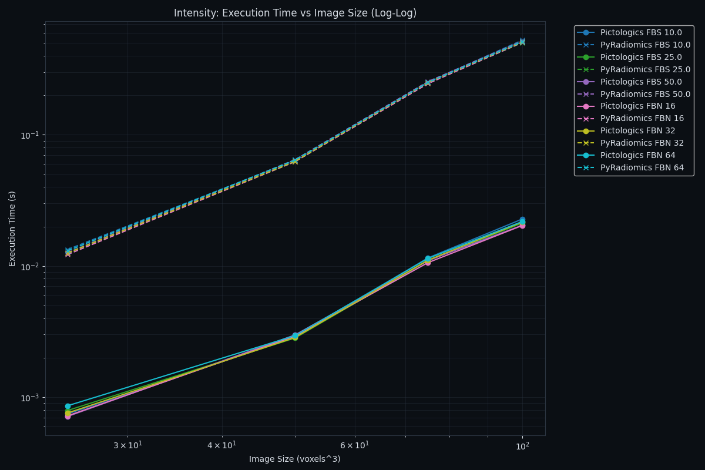
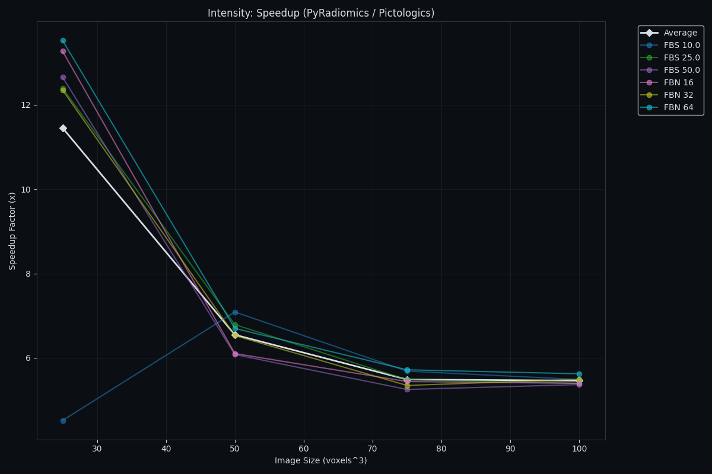
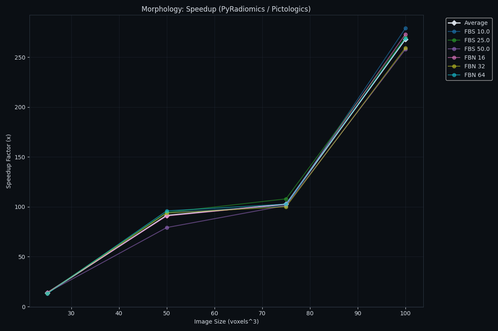
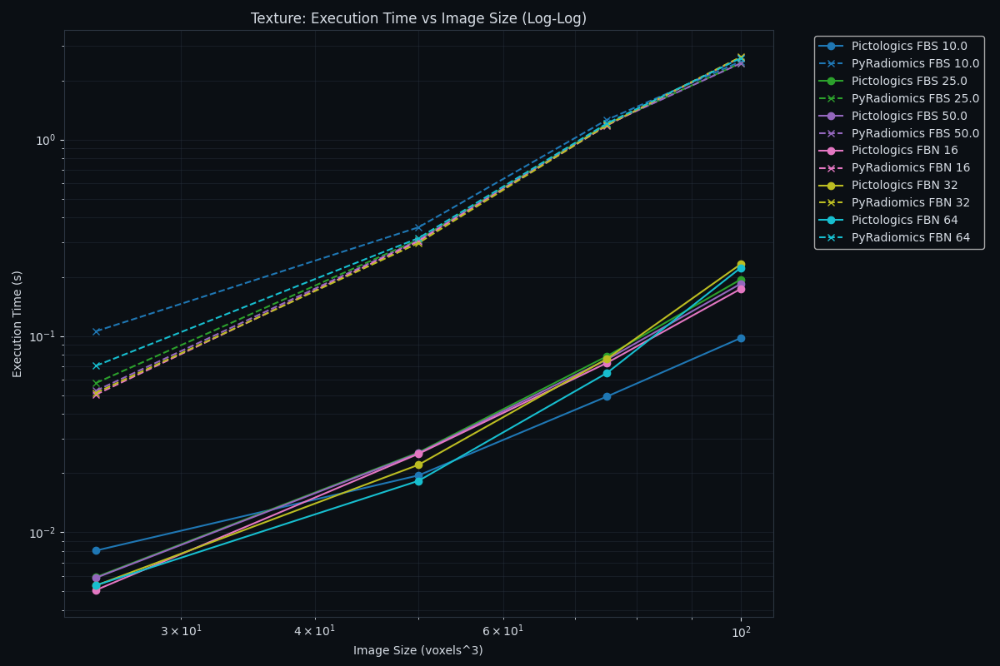
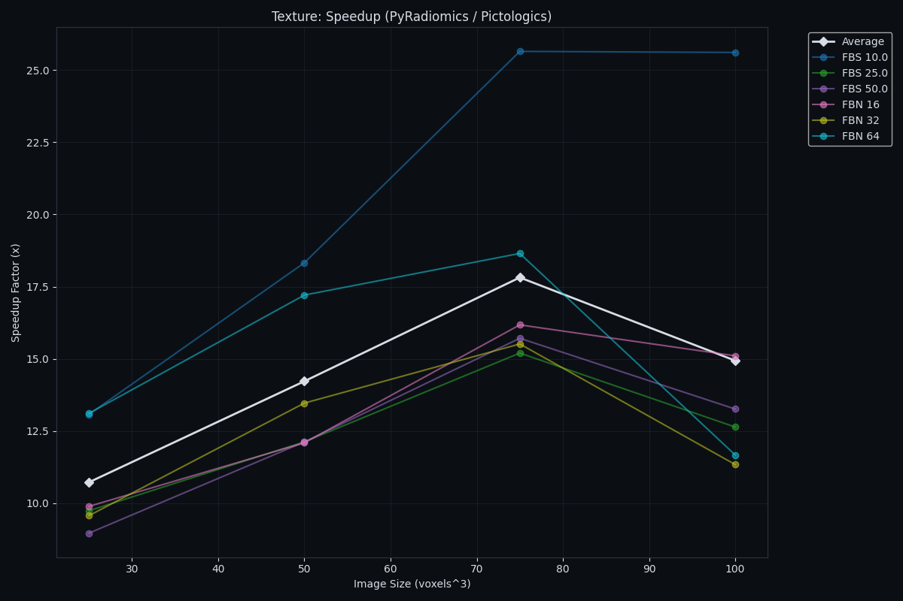

# Benchmarks

## Performance Benchmarks

### Benchmark Configuration

Comparisons between **Pictologics** and **PyRadiomics** (single-thread parity). 

**Test Data Generation:**

- **Texture**: 3D correlated noise generated using Gaussian smoothing.
- **Mask**: Blob-like structures generated via thresholded smooth noise with random holes.
- **Voxel Distribution**: Mean=486.04, Std=90.24, Min=0.00, Max=1000.00.

### HARDWARE USED FOR CALCULATIONS

- **Hardware**: Apple M4 Pro, 14 cores, 48 GB
- **OS**: macOS 26.2 (arm64)
- **Python**: 3.12.10
- **Core deps**: pictologics 0.1.0, numpy 2.3.5, scipy 1.16.3, numba 0.62.1, pandas 2.3.3, matplotlib 3.10.7
- **PyRadiomics stack (parity runs)**: pyradiomics 3.1.1.dev111+g8ed579383, SimpleITK 2.5.3
- **BLAS/LAPACK**: Apple Accelerate (from `numpy.show_config()`)

Note: the benchmark script explicitly calls `warmup_jit()` before timing to avoid including Numba compilation overhead in the measured runtimes.

### Intensity

| Execution Time (Log-Log) | Speedup |
|:---:|:---:|
|  |  |

**Pictologics-only intensity families (IVH + spatial/local intensity):**

|   Size | Discretization   | Pictologics-only Time   | Pictologics-only Mem   |
|-------:|:-----------------|:------------------------|:-----------------------|
|     25 | FBS 10.0         | 0.0338 s                | 0.81 MB                |
|     25 | FBS 25.0         | 0.0291 s                | 0.81 MB                |
|     25 | FBS 50.0         | 0.0281 s                | 0.81 MB                |
|     25 | FBN 16           | 0.0327 s                | 0.81 MB                |
|     25 | FBN 32           | 0.0368 s                | 0.81 MB                |
|     25 | FBN 64           | 0.0364 s                | 0.81 MB                |
|     50 | FBS 10.0         | 1.3986 s                | 6.33 MB                |
|     50 | FBS 25.0         | 1.3755 s                | 6.33 MB                |
|     50 | FBS 50.0         | 1.3878 s                | 6.33 MB                |
|     50 | FBN 16           | 1.3481 s                | 6.33 MB                |
|     50 | FBN 32           | 1.3709 s                | 6.33 MB                |
|     50 | FBN 64           | 1.3488 s                | 6.33 MB                |
|     75 | FBS 10.0         | Not calculated          | Not calculated         |
|     75 | FBS 25.0         | Not calculated          | Not calculated         |
|     75 | FBS 50.0         | Not calculated          | Not calculated         |
|     75 | FBN 16           | Not calculated          | Not calculated         |
|     75 | FBN 32           | Not calculated          | Not calculated         |
|     75 | FBN 64           | Not calculated          | Not calculated         |
|    100 | FBS 10.0         | Not calculated          | Not calculated         |
|    100 | FBS 25.0         | Not calculated          | Not calculated         |
|    100 | FBS 50.0         | Not calculated          | Not calculated         |
|    100 | FBN 16           | Not calculated          | Not calculated         |
|    100 | FBN 32           | Not calculated          | Not calculated         |
|    100 | FBN 64           | Not calculated          | Not calculated         |

### Morphology

| Execution Time (Log-Log) | Speedup |
|:---:|:---:|
|  |  |

**Pictologics-only morphology families (intensity-weighted morphology):**

|   Size | Discretization   | Pictologics-only Time   | Pictologics-only Mem   |
|-------:|:-----------------|:------------------------|:-----------------------|
|     25 | FBS 10.0         | 0.0040 s                | 1.11 MB                |
|     25 | FBS 25.0         | 0.0042 s                | 1.11 MB                |
|     25 | FBS 50.0         | 0.0043 s                | 1.11 MB                |
|     25 | FBN 16           | 0.0045 s                | 1.11 MB                |
|     25 | FBN 32           | 0.0050 s                | 1.11 MB                |
|     25 | FBN 64           | 0.0056 s                | 1.10 MB                |
|     50 | FBS 10.0         | 0.0108 s                | 5.37 MB                |
|     50 | FBS 25.0         | 0.0101 s                | 5.37 MB                |
|     50 | FBS 50.0         | 0.0103 s                | 5.37 MB                |
|     50 | FBN 16           | 0.0106 s                | 5.37 MB                |
|     50 | FBN 32           | 0.0114 s                | 5.37 MB                |
|     50 | FBN 64           | 0.0105 s                | 5.37 MB                |
|     75 | FBS 10.0         | 0.0170 s                | 8.77 MB                |
|     75 | FBS 25.0         | 0.0172 s                | 8.77 MB                |
|     75 | FBS 50.0         | 0.0166 s                | 8.77 MB                |
|     75 | FBN 16           | 0.0167 s                | 8.77 MB                |
|     75 | FBN 32           | 0.0168 s                | 8.77 MB                |
|     75 | FBN 64           | 0.0173 s                | 8.77 MB                |
|    100 | FBS 10.0         | 0.0346 s                | 20.40 MB               |
|    100 | FBS 25.0         | 0.0329 s                | 20.40 MB               |
|    100 | FBS 50.0         | 0.0325 s                | 20.40 MB               |
|    100 | FBN 16           | 0.0323 s                | 20.40 MB               |
|    100 | FBN 32           | 0.0334 s                | 20.40 MB               |
|    100 | FBN 64           | 0.0331 s                | 20.40 MB               |

### Texture

| Execution Time (Log-Log) | Speedup |
|:---:|:---:|
|  |  |

**Pictologics-only texture families (GLDZM):**

|   Size | Discretization   | Pictologics-only Time   | Pictologics-only Mem   |
|-------:|:-----------------|:------------------------|:-----------------------|
|     25 | FBS 10.0         | 0.0002 s                | 0.08 MB                |
|     25 | FBS 25.0         | 0.0002 s                | 0.07 MB                |
|     25 | FBS 50.0         | 0.0002 s                | 0.07 MB                |
|     25 | FBN 16           | 0.0002 s                | 0.07 MB                |
|     25 | FBN 32           | 0.0002 s                | 0.07 MB                |
|     25 | FBN 64           | 0.0002 s                | 0.07 MB                |
|     50 | FBS 10.0         | 0.0002 s                | 0.10 MB                |
|     50 | FBS 25.0         | 0.0002 s                | 0.08 MB                |
|     50 | FBS 50.0         | 0.0003 s                | 0.07 MB                |
|     50 | FBN 16           | 0.0002 s                | 0.07 MB                |
|     50 | FBN 32           | 0.0002 s                | 0.07 MB                |
|     50 | FBN 64           | 0.0002 s                | 0.09 MB                |
|     75 | FBS 10.0         | 0.0003 s                | 0.15 MB                |
|     75 | FBS 25.0         | 0.0003 s                | 0.10 MB                |
|     75 | FBS 50.0         | 0.0003 s                | 0.08 MB                |
|     75 | FBN 16           | 0.0003 s                | 0.08 MB                |
|     75 | FBN 32           | 0.0003 s                | 0.09 MB                |
|     75 | FBN 64           | 0.0003 s                | 0.12 MB                |
|    100 | FBS 10.0         | 0.0004 s                | 0.14 MB                |
|    100 | FBS 25.0         | 0.0003 s                | 0.09 MB                |
|    100 | FBS 50.0         | 0.0003 s                | 0.08 MB                |
|    100 | FBN 16           | 0.0003 s                | 0.07 MB                |
|    100 | FBN 32           | 0.0004 s                | 0.09 MB                |
|    100 | FBN 64           | 0.0004 s                | 0.11 MB                |

### Detailed Parity Results

| Family     |   Size | Discretization   | Pictologics Time   | PyRadiomics Time   | Speedup   | Pictologics Mem   | PyRadiomics Mem   |
|:-----------|-------:|:-----------------|:-------------------|:-------------------|:----------|:------------------|:------------------|
| Intensity  |     25 | FBN 16           | 0.0008 s           | 0.0131 s           | 17.04x    | 0.24 MB           | 0.71 MB           |
| Intensity  |     25 | FBN 32           | 0.0007 s           | 0.0141 s           | 19.27x    | 0.24 MB           | 0.71 MB           |
| Intensity  |     25 | FBN 64           | 0.0008 s           | 0.0142 s           | 17.34x    | 0.24 MB           | 0.71 MB           |
| Intensity  |     25 | FBS 10.0         | 0.0008 s           | 0.0167 s           | 20.63x    | 0.24 MB           | 0.74 MB           |
| Intensity  |     25 | FBS 25.0         | 0.0008 s           | 0.0128 s           | 16.73x    | 0.24 MB           | 0.71 MB           |
| Intensity  |     25 | FBS 50.0         | 0.0007 s           | 0.0140 s           | 19.10x    | 0.24 MB           | 0.71 MB           |
| Intensity  |     50 | FBN 16           | 0.0030 s           | 0.0678 s           | 22.63x    | 1.40 MB           | 4.61 MB           |
| Intensity  |     50 | FBN 32           | 0.0030 s           | 0.0665 s           | 21.98x    | 1.40 MB           | 4.61 MB           |
| Intensity  |     50 | FBN 64           | 0.0034 s           | 0.0650 s           | 18.86x    | 1.40 MB           | 4.61 MB           |
| Intensity  |     50 | FBS 10.0         | 0.0031 s           | 0.0693 s           | 22.08x    | 1.40 MB           | 4.61 MB           |
| Intensity  |     50 | FBS 25.0         | 0.0030 s           | 0.0655 s           | 21.48x    | 1.40 MB           | 4.61 MB           |
| Intensity  |     50 | FBS 50.0         | 0.0029 s           | 0.0679 s           | 23.48x    | 1.40 MB           | 4.61 MB           |
| Intensity  |     75 | FBN 16           | 0.0112 s           | 0.2558 s           | 22.83x    | 5.81 MB           | 17.95 MB          |
| Intensity  |     75 | FBN 32           | 0.0114 s           | 0.2508 s           | 22.07x    | 5.81 MB           | 17.95 MB          |
| Intensity  |     75 | FBN 64           | 0.0116 s           | 0.2633 s           | 22.69x    | 5.81 MB           | 17.95 MB          |
| Intensity  |     75 | FBS 10.0         | 0.0123 s           | 0.2681 s           | 21.83x    | 5.81 MB           | 17.95 MB          |
| Intensity  |     75 | FBS 25.0         | 0.0116 s           | 0.2630 s           | 22.68x    | 5.81 MB           | 17.95 MB          |
| Intensity  |     75 | FBS 50.0         | 0.0109 s           | 0.2552 s           | 23.47x    | 5.81 MB           | 17.95 MB          |
| Intensity  |    100 | FBN 16           | 0.0207 s           | 0.5109 s           | 24.69x    | 12.16 MB          | 39.01 MB          |
| Intensity  |    100 | FBN 32           | 0.0227 s           | 0.5174 s           | 22.83x    | 12.16 MB          | 39.01 MB          |
| Intensity  |    100 | FBN 64           | 0.0228 s           | 0.5274 s           | 23.15x    | 12.16 MB          | 39.01 MB          |
| Intensity  |    100 | FBS 10.0         | 0.0258 s           | 0.5471 s           | 21.23x    | 12.16 MB          | 39.01 MB          |
| Intensity  |    100 | FBS 25.0         | 0.0245 s           | 0.5285 s           | 21.60x    | 12.16 MB          | 39.01 MB          |
| Intensity  |    100 | FBS 50.0         | 0.0209 s           | 0.5102 s           | 24.37x    | 12.16 MB          | 39.01 MB          |
| Morphology |     25 | FBN 16           | 0.0040 s           | 0.0536 s           | 13.34x    | 1.11 MB           | 1.18 MB           |
| Morphology |     25 | FBN 32           | 0.0051 s           | 0.0549 s           | 10.81x    | 1.11 MB           | 1.18 MB           |
| Morphology |     25 | FBN 64           | 0.0045 s           | 0.0562 s           | 12.62x    | 1.11 MB           | 1.18 MB           |
| Morphology |     25 | FBS 10.0         | 0.0041 s           | 0.0517 s           | 12.52x    | 1.11 MB           | 1.18 MB           |
| Morphology |     25 | FBS 25.0         | 0.0040 s           | 0.0521 s           | 13.19x    | 1.11 MB           | 1.18 MB           |
| Morphology |     25 | FBS 50.0         | 0.0041 s           | 0.0525 s           | 12.84x    | 1.11 MB           | 1.18 MB           |
| Morphology |     50 | FBN 16           | 0.0102 s           | 0.9643 s           | 94.57x    | 5.37 MB           | 8.68 MB           |
| Morphology |     50 | FBN 32           | 0.0107 s           | 0.9692 s           | 90.69x    | 5.37 MB           | 8.68 MB           |
| Morphology |     50 | FBN 64           | 0.0105 s           | 0.9629 s           | 91.78x    | 5.37 MB           | 8.68 MB           |
| Morphology |     50 | FBS 10.0         | 0.0104 s           | 0.9326 s           | 90.09x    | 5.37 MB           | 8.68 MB           |
| Morphology |     50 | FBS 25.0         | 0.0101 s           | 0.9486 s           | 93.73x    | 5.37 MB           | 8.68 MB           |
| Morphology |     50 | FBS 50.0         | 0.0114 s           | 0.9589 s           | 84.42x    | 5.37 MB           | 8.68 MB           |
| Morphology |     75 | FBN 16           | 0.0167 s           | 1.7319 s           | 103.55x   | 8.77 MB           | 36.60 MB          |
| Morphology |     75 | FBN 32           | 0.0163 s           | 1.7432 s           | 106.73x   | 8.77 MB           | 36.60 MB          |
| Morphology |     75 | FBN 64           | 0.0163 s           | 1.7210 s           | 105.58x   | 8.77 MB           | 36.60 MB          |
| Morphology |     75 | FBS 10.0         | 0.0168 s           | 1.7579 s           | 104.50x   | 8.77 MB           | 36.60 MB          |
| Morphology |     75 | FBS 25.0         | 0.0169 s           | 1.7515 s           | 103.60x   | 8.77 MB           | 36.60 MB          |
| Morphology |     75 | FBS 50.0         | 0.0162 s           | 1.7328 s           | 106.89x   | 8.77 MB           | 36.60 MB          |
| Morphology |    100 | FBN 16           | 0.0327 s           | 8.4654 s           | 259.01x   | 20.40 MB          | 77.49 MB          |
| Morphology |    100 | FBN 32           | 0.0344 s           | 8.4468 s           | 245.60x   | 20.40 MB          | 77.49 MB          |
| Morphology |    100 | FBN 64           | 0.0325 s           | 8.4553 s           | 260.15x   | 20.40 MB          | 77.49 MB          |
| Morphology |    100 | FBS 10.0         | 0.0372 s           | 8.7632 s           | 235.81x   | 20.40 MB          | 77.49 MB          |
| Morphology |    100 | FBS 25.0         | 0.0339 s           | 8.7034 s           | 256.94x   | 20.40 MB          | 77.49 MB          |
| Morphology |    100 | FBS 50.0         | 0.0315 s           | 8.5339 s           | 270.73x   | 20.40 MB          | 77.49 MB          |
| Texture    |     25 | FBN 16           | 0.0054 s           | 0.0490 s           | 9.01x     | 2.13 MB           | 0.69 MB           |
| Texture    |     25 | FBN 32           | 0.0055 s           | 0.0526 s           | 9.52x     | 2.07 MB           | 0.75 MB           |
| Texture    |     25 | FBN 64           | 0.0065 s           | 0.0669 s           | 10.31x    | 4.53 MB           | 1.94 MB           |
| Texture    |     25 | FBS 10.0         | 0.0070 s           | 0.0929 s           | 13.19x    | 10.10 MB          | 3.77 MB           |
| Texture    |     25 | FBS 25.0         | 0.0055 s           | 0.0529 s           | 9.70x     | 2.16 MB           | 0.91 MB           |
| Texture    |     25 | FBS 50.0         | 0.0049 s           | 0.0499 s           | 10.09x    | 2.13 MB           | 0.71 MB           |
| Texture    |     50 | FBN 16           | 0.0232 s           | 0.3049 s           | 13.15x    | 19.85 MB          | 6.29 MB           |
| Texture    |     50 | FBN 32           | 0.0272 s           | 0.3064 s           | 11.25x    | 19.95 MB          | 6.29 MB           |
| Texture    |     50 | FBN 64           | 0.0185 s           | 0.3247 s           | 17.52x    | 9.83 MB           | 4.82 MB           |
| Texture    |     50 | FBS 10.0         | 0.0177 s           | 0.3546 s           | 20.08x    | 11.96 MB          | 5.41 MB           |
| Texture    |     50 | FBS 25.0         | 0.0241 s           | 0.3082 s           | 12.77x    | 19.30 MB          | 6.09 MB           |
| Texture    |     50 | FBS 50.0         | 0.0252 s           | 0.3011 s           | 11.94x    | 21.08 MB          | 6.60 MB           |
| Texture    |     75 | FBN 16           | 0.0804 s           | 1.2068 s           | 15.02x    | 84.43 MB          | 25.62 MB          |
| Texture    |     75 | FBN 32           | 0.0784 s           | 1.2143 s           | 15.50x    | 86.59 MB          | 26.23 MB          |
| Texture    |     75 | FBN 64           | 0.0683 s           | 1.2584 s           | 18.42x    | 63.72 MB          | 20.14 MB          |
| Texture    |     75 | FBS 10.0         | 0.0498 s           | 1.2776 s           | 25.66x    | 13.36 MB          | 17.08 MB          |
| Texture    |     75 | FBS 25.0         | 0.0885 s           | 1.2097 s           | 13.66x    | 89.44 MB          | 25.80 MB          |
| Texture    |     75 | FBS 50.0         | 0.0785 s           | 1.2392 s           | 15.79x    | 88.88 MB          | 25.65 MB          |
| Texture    |    100 | FBN 16           | 0.1793 s           | 2.4813 s           | 13.84x    | 213.37 MB         | 64.12 MB          |
| Texture    |    100 | FBN 32           | 0.1958 s           | 2.4967 s           | 12.75x    | 224.11 MB         | 66.17 MB          |
| Texture    |    100 | FBN 64           | 0.1955 s           | 2.4948 s           | 12.76x    | 204.71 MB         | 60.71 MB          |
| Texture    |    100 | FBS 10.0         | 0.1071 s           | 2.6041 s           | 24.32x    | 22.17 MB          | 37.15 MB          |
| Texture    |    100 | FBS 25.0         | 0.2071 s           | 2.5108 s           | 12.12x    | 230.74 MB         | 68.10 MB          |
| Texture    |    100 | FBS 50.0         | 0.1858 s           | 2.4789 s           | 13.34x    | 229.77 MB         | 68.48 MB          |

