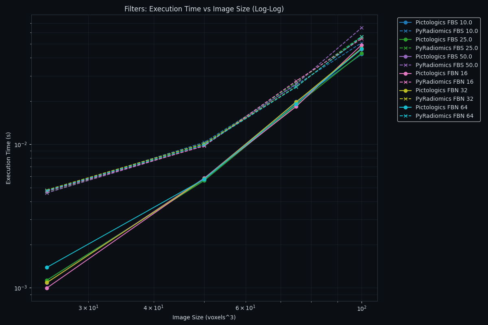
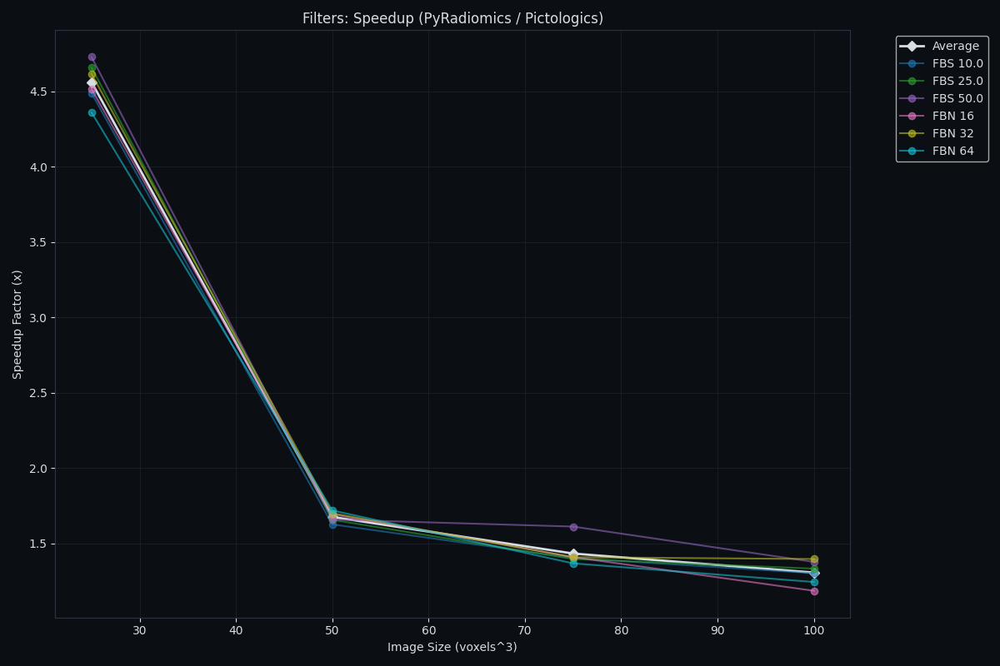

# Benchmarks

## Performance Benchmarks

### Benchmark Configuration

Comparisons between **Pictologics** and **PyRadiomics** (single-thread parity). 

**Test Data Generation:**

- **Texture**: 3D correlated noise generated using Gaussian smoothing.
- **Mask**: Blob-like structures generated via thresholded smooth noise with random holes.
- **Voxel Distribution**: Mean=486.04, Std=90.24, Min=0.00, Max=1000.00.

### HARDWARE USED FOR CALCULATIONS

- **Hardware**: Apple M4 Pro, 14 cores, 48 GB
- **OS**: macOS 26.2 (arm64)
- **Python**: 3.12.10
- **Core deps**: pictologics 0.3.3, numpy 2.2.6, scipy 1.17.0, numba 0.62.1, pandas 2.3.3, matplotlib 3.10.7
- **PyRadiomics stack (parity runs)**: pyradiomics 3.1.1.dev111+g8ed579383, SimpleITK 2.5.3
- **BLAS/LAPACK**: Apple Accelerate (from `numpy.show_config()`)

Note: the benchmark script explicitly calls `warmup_jit()` before timing to avoid including Numba compilation overhead in the measured runtimes. Timing and memory measurement are separated — `tracemalloc` is NOT active during timing to avoid biasing the comparison (its per-allocation hooks penalise pure-Python code more than JIT/C code). All calculations are repeated 5 times and the **mean** runtime is reported; peak memory is measured once separately.

### Intensity

| Execution Time (Log-Log) | Speedup |
|:---:|:---:|
|  |  |

**Pictologics-only intensity families (IVH + spatial/local intensity):**

|   Size | Discretization   | Pictologics-only Time   | Pictologics-only Mem   |
|-------:|:-----------------|:------------------------|:-----------------------|
|     25 | FBS 10.0         | 0.0298 s                | 0.81 MB                |
|     25 | FBS 25.0         | 0.0295 s                | 0.81 MB                |
|     25 | FBS 50.0         | 0.0289 s                | 0.81 MB                |
|     25 | FBN 16           | 0.0290 s                | 0.81 MB                |
|     25 | FBN 32           | 0.0275 s                | 0.81 MB                |
|     25 | FBN 64           | 0.0302 s                | 0.81 MB                |
|     50 | FBS 10.0         | 1.2636 s                | 6.33 MB                |
|     50 | FBS 25.0         | 1.2756 s                | 6.33 MB                |
|     50 | FBS 50.0         | 1.2750 s                | 6.33 MB                |
|     50 | FBN 16           | 1.2912 s                | 6.33 MB                |
|     50 | FBN 32           | 1.2832 s                | 6.33 MB                |
|     50 | FBN 64           | 1.2549 s                | 6.33 MB                |
|     75 | FBS 10.0         | Not calculated          | Not calculated         |
|     75 | FBS 25.0         | Not calculated          | Not calculated         |
|     75 | FBS 50.0         | Not calculated          | Not calculated         |
|     75 | FBN 16           | Not calculated          | Not calculated         |
|     75 | FBN 32           | Not calculated          | Not calculated         |
|     75 | FBN 64           | Not calculated          | Not calculated         |
|    100 | FBS 10.0         | Not calculated          | Not calculated         |
|    100 | FBS 25.0         | Not calculated          | Not calculated         |
|    100 | FBS 50.0         | Not calculated          | Not calculated         |
|    100 | FBN 16           | Not calculated          | Not calculated         |
|    100 | FBN 32           | Not calculated          | Not calculated         |
|    100 | FBN 64           | Not calculated          | Not calculated         |

### Morphology

| Execution Time (Log-Log) | Speedup |
|:---:|:---:|
|  |  |

**Pictologics-only morphology families (intensity-weighted morphology):**

|   Size | Discretization   | Pictologics-only Time   | Pictologics-only Mem   |
|-------:|:-----------------|:------------------------|:-----------------------|
|     25 | FBS 10.0         | 0.0033 s                | 1.17 MB                |
|     25 | FBS 25.0         | 0.0029 s                | 1.17 MB                |
|     25 | FBS 50.0         | 0.0031 s                | 1.17 MB                |
|     25 | FBN 16           | 0.0031 s                | 1.17 MB                |
|     25 | FBN 32           | 0.0033 s                | 1.17 MB                |
|     25 | FBN 64           | 0.0031 s                | 1.17 MB                |
|     50 | FBS 10.0         | 0.0092 s                | 5.43 MB                |
|     50 | FBS 25.0         | 0.0090 s                | 5.43 MB                |
|     50 | FBS 50.0         | 0.0098 s                | 5.43 MB                |
|     50 | FBN 16           | 0.0094 s                | 5.43 MB                |
|     50 | FBN 32           | 0.0093 s                | 5.43 MB                |
|     50 | FBN 64           | 0.0094 s                | 5.43 MB                |
|     75 | FBS 10.0         | 0.0160 s                | 8.84 MB                |
|     75 | FBS 25.0         | 0.0160 s                | 8.84 MB                |
|     75 | FBS 50.0         | 0.0161 s                | 8.84 MB                |
|     75 | FBN 16           | 0.0159 s                | 8.84 MB                |
|     75 | FBN 32           | 0.0164 s                | 8.84 MB                |
|     75 | FBN 64           | 0.0158 s                | 8.84 MB                |
|    100 | FBS 10.0         | 0.0327 s                | 20.46 MB               |
|    100 | FBS 25.0         | 0.0316 s                | 20.46 MB               |
|    100 | FBS 50.0         | 0.0334 s                | 20.46 MB               |
|    100 | FBN 16           | 0.0317 s                | 20.46 MB               |
|    100 | FBN 32           | 0.0314 s                | 20.46 MB               |
|    100 | FBN 64           | 0.0310 s                | 20.46 MB               |

### Texture

| Execution Time (Log-Log) | Speedup |
|:---:|:---:|
|  |  |

**Pictologics-only texture families (GLDZM):**

|   Size | Discretization   | Pictologics-only Time   | Pictologics-only Mem   |
|-------:|:-----------------|:------------------------|:-----------------------|
|     25 | FBS 10.0         | 0.0001 s                | 0.15 MB                |
|     25 | FBS 25.0         | 0.0001 s                | 0.13 MB                |
|     25 | FBS 50.0         | 0.0001 s                | 0.13 MB                |
|     25 | FBN 16           | 0.0001 s                | 0.13 MB                |
|     25 | FBN 32           | 0.0001 s                | 0.13 MB                |
|     25 | FBN 64           | 0.0001 s                | 0.14 MB                |
|     50 | FBS 10.0         | 0.0001 s                | 0.16 MB                |
|     50 | FBS 25.0         | 0.0001 s                | 0.14 MB                |
|     50 | FBS 50.0         | 0.0001 s                | 0.13 MB                |
|     50 | FBN 16           | 0.0001 s                | 0.13 MB                |
|     50 | FBN 32           | 0.0001 s                | 0.14 MB                |
|     50 | FBN 64           | 0.0001 s                | 0.15 MB                |
|     75 | FBS 10.0         | 0.0001 s                | 0.21 MB                |
|     75 | FBS 25.0         | 0.0001 s                | 0.16 MB                |
|     75 | FBS 50.0         | 0.0002 s                | 0.14 MB                |
|     75 | FBN 16           | 0.0002 s                | 0.14 MB                |
|     75 | FBN 32           | 0.0001 s                | 0.15 MB                |
|     75 | FBN 64           | 0.0001 s                | 0.18 MB                |
|    100 | FBS 10.0         | 0.0002 s                | 0.20 MB                |
|    100 | FBS 25.0         | 0.0002 s                | 0.16 MB                |
|    100 | FBS 50.0         | 0.0002 s                | 0.14 MB                |
|    100 | FBN 16           | 0.0002 s                | 0.14 MB                |
|    100 | FBN 32           | 0.0002 s                | 0.15 MB                |
|    100 | FBN 64           | 0.0002 s                | 0.17 MB                |

### Filters

| Execution Time (Log-Log) | Speedup |
|:---:|:---:|
|  |  |

**Pictologics-only filters (Gabor, Laws, Simoncelli, Riesz, Mean):**

|   Size | Discretization   | Pictologics-only Time   | Pictologics-only Mem   |
|-------:|:-----------------|:------------------------|:-----------------------|
|     25 | FBS 10.0         | 0.0037 s                | 1.70 MB                |
|     25 | FBS 25.0         | 0.0038 s                | 1.70 MB                |
|     25 | FBS 50.0         | 0.0044 s                | 1.70 MB                |
|     25 | FBN 16           | 0.0040 s                | 1.70 MB                |
|     25 | FBN 32           | 0.0037 s                | 1.70 MB                |
|     25 | FBN 64           | 0.0043 s                | 1.69 MB                |
|     50 | FBS 10.0         | 0.0160 s                | 13.49 MB               |
|     50 | FBS 25.0         | 0.0154 s                | 13.49 MB               |
|     50 | FBS 50.0         | 0.0152 s                | 13.50 MB               |
|     50 | FBN 16           | 0.0152 s                | 13.49 MB               |
|     50 | FBN 32           | 0.0157 s                | 13.49 MB               |
|     50 | FBN 64           | 0.0156 s                | 13.49 MB               |
|     75 | FBS 10.0         | 0.0372 s                | 45.49 MB               |
|     75 | FBS 25.0         | 0.0378 s                | 45.49 MB               |
|     75 | FBS 50.0         | 0.0375 s                | 45.49 MB               |
|     75 | FBN 16           | 0.0383 s                | 45.49 MB               |
|     75 | FBN 32           | 0.0408 s                | 45.49 MB               |
|     75 | FBN 64           | 0.0383 s                | 45.49 MB               |
|    100 | FBS 10.0         | 0.0817 s                | 107.80 MB              |
|    100 | FBS 25.0         | 0.0804 s                | 107.80 MB              |
|    100 | FBS 50.0         | 0.0846 s                | 107.79 MB              |
|    100 | FBN 16           | 0.0823 s                | 107.80 MB              |
|    100 | FBN 32           | 0.0807 s                | 107.80 MB              |
|    100 | FBN 64           | 0.0818 s                | 107.80 MB              |

### Detailed Parity Results

| Family     |   Size | Discretization   | Pictologics Time   | PyRadiomics Time   | Speedup   | Pictologics Mem   | PyRadiomics Mem   |
|:-----------|-------:|:-----------------|:-------------------|:-------------------|:----------|:------------------|:------------------|
| Filters    |     25 | FBN 16           | 0.0008 s           | 0.0037 s           | 4.71x     | 0.48 MB           | 0.94 MB           |
| Filters    |     25 | FBN 32           | 0.0008 s           | 0.0038 s           | 5.01x     | 0.48 MB           | 0.94 MB           |
| Filters    |     25 | FBN 64           | 0.0009 s           | 0.0037 s           | 4.28x     | 0.48 MB           | 0.94 MB           |
| Filters    |     25 | FBS 10.0         | 0.0009 s           | 0.0037 s           | 4.14x     | 0.48 MB           | 0.94 MB           |
| Filters    |     25 | FBS 25.0         | 0.0008 s           | 0.0038 s           | 4.67x     | 0.48 MB           | 0.94 MB           |
| Filters    |     25 | FBS 50.0         | 0.0009 s           | 0.0038 s           | 4.10x     | 0.48 MB           | 0.94 MB           |
| Filters    |     50 | FBN 16           | 0.0053 s           | 0.0093 s           | 1.74x     | 3.82 MB           | 6.68 MB           |
| Filters    |     50 | FBN 32           | 0.0054 s           | 0.0092 s           | 1.70x     | 3.82 MB           | 6.68 MB           |
| Filters    |     50 | FBN 64           | 0.0053 s           | 0.0093 s           | 1.74x     | 3.82 MB           | 6.68 MB           |
| Filters    |     50 | FBS 10.0         | 0.0053 s           | 0.0092 s           | 1.74x     | 3.82 MB           | 6.68 MB           |
| Filters    |     50 | FBS 25.0         | 0.0053 s           | 0.0091 s           | 1.72x     | 3.82 MB           | 6.68 MB           |
| Filters    |     50 | FBS 50.0         | 0.0053 s           | 0.0092 s           | 1.73x     | 3.82 MB           | 6.68 MB           |
| Filters    |     75 | FBN 16           | 0.0181 s           | 0.0255 s           | 1.41x     | 12.88 MB          | 23.38 MB          |
| Filters    |     75 | FBN 32           | 0.0190 s           | 0.0251 s           | 1.32x     | 12.88 MB          | 23.38 MB          |
| Filters    |     75 | FBN 64           | 0.0182 s           | 0.0257 s           | 1.41x     | 12.88 MB          | 23.38 MB          |
| Filters    |     75 | FBS 10.0         | 0.0181 s           | 0.0254 s           | 1.40x     | 12.88 MB          | 23.38 MB          |
| Filters    |     75 | FBS 25.0         | 0.0181 s           | 0.0251 s           | 1.39x     | 12.88 MB          | 23.38 MB          |
| Filters    |     75 | FBS 50.0         | 0.0181 s           | 0.0256 s           | 1.42x     | 12.88 MB          | 23.38 MB          |
| Filters    |    100 | FBN 16           | 0.0424 s           | 0.0520 s           | 1.23x     | 30.52 MB          | 53.41 MB          |
| Filters    |    100 | FBN 32           | 0.0423 s           | 0.0515 s           | 1.22x     | 30.52 MB          | 53.41 MB          |
| Filters    |    100 | FBN 64           | 0.0425 s           | 0.0509 s           | 1.20x     | 30.52 MB          | 53.41 MB          |
| Filters    |    100 | FBS 10.0         | 0.0450 s           | 0.0513 s           | 1.14x     | 30.52 MB          | 53.41 MB          |
| Filters    |    100 | FBS 25.0         | 0.0427 s           | 0.0532 s           | 1.24x     | 30.52 MB          | 53.41 MB          |
| Filters    |    100 | FBS 50.0         | 0.0469 s           | 0.0508 s           | 1.08x     | 30.52 MB          | 53.41 MB          |
| Intensity  |     25 | FBN 16           | 0.0004 s           | 0.0049 s           | 13.27x    | 0.24 MB           | 0.71 MB           |
| Intensity  |     25 | FBN 32           | 0.0004 s           | 0.0050 s           | 12.35x    | 0.24 MB           | 0.71 MB           |
| Intensity  |     25 | FBN 64           | 0.0004 s           | 0.0054 s           | 13.52x    | 0.24 MB           | 0.71 MB           |
| Intensity  |     25 | FBS 10.0         | 0.0012 s           | 0.0056 s           | 4.52x     | 0.24 MB           | 0.71 MB           |
| Intensity  |     25 | FBS 25.0         | 0.0004 s           | 0.0052 s           | 12.39x    | 0.24 MB           | 0.71 MB           |
| Intensity  |     25 | FBS 50.0         | 0.0004 s           | 0.0048 s           | 12.65x    | 0.24 MB           | 0.71 MB           |
| Intensity  |     50 | FBN 16           | 0.0026 s           | 0.0158 s           | 6.10x     | 1.40 MB           | 4.61 MB           |
| Intensity  |     50 | FBN 32           | 0.0025 s           | 0.0163 s           | 6.53x     | 1.40 MB           | 4.61 MB           |
| Intensity  |     50 | FBN 64           | 0.0026 s           | 0.0174 s           | 6.70x     | 1.40 MB           | 4.61 MB           |
| Intensity  |     50 | FBS 10.0         | 0.0025 s           | 0.0178 s           | 7.09x     | 1.40 MB           | 4.61 MB           |
| Intensity  |     50 | FBS 25.0         | 0.0025 s           | 0.0169 s           | 6.79x     | 1.40 MB           | 4.61 MB           |
| Intensity  |     50 | FBS 50.0         | 0.0026 s           | 0.0161 s           | 6.08x     | 1.40 MB           | 4.61 MB           |
| Intensity  |     75 | FBN 16           | 0.0103 s           | 0.0559 s           | 5.44x     | 5.81 MB           | 17.95 MB          |
| Intensity  |     75 | FBN 32           | 0.0109 s           | 0.0581 s           | 5.35x     | 5.81 MB           | 17.95 MB          |
| Intensity  |     75 | FBN 64           | 0.0109 s           | 0.0625 s           | 5.72x     | 5.81 MB           | 17.95 MB          |
| Intensity  |     75 | FBS 10.0         | 0.0111 s           | 0.0631 s           | 5.69x     | 5.81 MB           | 17.95 MB          |
| Intensity  |     75 | FBS 25.0         | 0.0109 s           | 0.0595 s           | 5.48x     | 5.81 MB           | 17.95 MB          |
| Intensity  |     75 | FBS 50.0         | 0.0105 s           | 0.0554 s           | 5.25x     | 5.81 MB           | 17.94 MB          |
| Intensity  |    100 | FBN 16           | 0.0200 s           | 0.1080 s           | 5.40x     | 12.16 MB          | 39.00 MB          |
| Intensity  |    100 | FBN 32           | 0.0210 s           | 0.1151 s           | 5.49x     | 12.16 MB          | 39.00 MB          |
| Intensity  |    100 | FBN 64           | 0.0214 s           | 0.1200 s           | 5.62x     | 12.16 MB          | 39.00 MB          |
| Intensity  |    100 | FBS 10.0         | 0.0238 s           | 0.1308 s           | 5.49x     | 12.16 MB          | 39.01 MB          |
| Intensity  |    100 | FBS 25.0         | 0.0212 s           | 0.1146 s           | 5.40x     | 12.16 MB          | 39.01 MB          |
| Intensity  |    100 | FBS 50.0         | 0.0215 s           | 0.1151 s           | 5.37x     | 12.16 MB          | 39.00 MB          |
| Morphology |     25 | FBN 16           | 0.0030 s           | 0.0525 s           | 17.60x    | 1.17 MB           | 1.18 MB           |
| Morphology |     25 | FBN 32           | 0.0029 s           | 0.0524 s           | 17.98x    | 1.17 MB           | 1.18 MB           |
| Morphology |     25 | FBN 64           | 0.0030 s           | 0.0529 s           | 17.70x    | 1.17 MB           | 1.18 MB           |
| Morphology |     25 | FBS 10.0         | 0.0043 s           | 0.0531 s           | 12.47x    | 1.17 MB           | 1.18 MB           |
| Morphology |     25 | FBS 25.0         | 0.0029 s           | 0.0532 s           | 18.22x    | 1.17 MB           | 1.18 MB           |
| Morphology |     25 | FBS 50.0         | 0.0030 s           | 0.0523 s           | 17.64x    | 1.17 MB           | 1.18 MB           |
| Morphology |     50 | FBN 16           | 0.0093 s           | 0.9535 s           | 102.15x   | 5.43 MB           | 8.68 MB           |
| Morphology |     50 | FBN 32           | 0.0095 s           | 0.9532 s           | 100.82x   | 5.43 MB           | 8.68 MB           |
| Morphology |     50 | FBN 64           | 0.0093 s           | 0.9564 s           | 102.85x   | 5.43 MB           | 8.68 MB           |
| Morphology |     50 | FBS 10.0         | 0.0093 s           | 0.9459 s           | 101.83x   | 5.43 MB           | 8.68 MB           |
| Morphology |     50 | FBS 25.0         | 0.0091 s           | 0.9551 s           | 105.36x   | 5.43 MB           | 8.68 MB           |
| Morphology |     50 | FBS 50.0         | 0.0096 s           | 0.9524 s           | 99.54x    | 5.43 MB           | 8.68 MB           |
| Morphology |     75 | FBN 16           | 0.0160 s           | 1.7255 s           | 108.00x   | 8.84 MB           | 36.60 MB          |
| Morphology |     75 | FBN 32           | 0.0158 s           | 1.7075 s           | 107.89x   | 8.84 MB           | 36.60 MB          |
| Morphology |     75 | FBN 64           | 0.0154 s           | 1.7000 s           | 110.09x   | 8.84 MB           | 36.60 MB          |
| Morphology |     75 | FBS 10.0         | 0.0156 s           | 1.7501 s           | 112.12x   | 8.84 MB           | 36.60 MB          |
| Morphology |     75 | FBS 25.0         | 0.0159 s           | 1.7368 s           | 109.01x   | 8.84 MB           | 36.60 MB          |
| Morphology |     75 | FBS 50.0         | 0.0159 s           | 1.7340 s           | 109.07x   | 8.84 MB           | 36.60 MB          |
| Morphology |    100 | FBN 16           | 0.0314 s           | 8.3858 s           | 267.25x   | 20.46 MB          | 77.49 MB          |
| Morphology |    100 | FBN 32           | 0.0313 s           | 8.3651 s           | 267.04x   | 20.46 MB          | 77.49 MB          |
| Morphology |    100 | FBN 64           | 0.0311 s           | 8.3842 s           | 269.81x   | 20.46 MB          | 77.49 MB          |
| Morphology |    100 | FBS 10.0         | 0.0332 s           | 8.6233 s           | 259.37x   | 20.46 MB          | 77.49 MB          |
| Morphology |    100 | FBS 25.0         | 0.0311 s           | 8.4174 s           | 270.87x   | 20.46 MB          | 77.49 MB          |
| Morphology |    100 | FBS 50.0         | 0.0328 s           | 8.4632 s           | 258.17x   | 20.46 MB          | 77.49 MB          |
| Texture    |     25 | FBN 16           | 0.0032 s           | 0.0129 s           | 4.07x     | 2.13 MB           | 0.69 MB           |
| Texture    |     25 | FBN 32           | 0.0034 s           | 0.0155 s           | 4.57x     | 2.07 MB           | 0.75 MB           |
| Texture    |     25 | FBN 64           | 0.0039 s           | 0.0262 s           | 6.69x     | 4.53 MB           | 1.95 MB           |
| Texture    |     25 | FBS 10.0         | 0.0057 s           | 0.0565 s           | 9.87x     | 10.10 MB          | 3.77 MB           |
| Texture    |     25 | FBS 25.0         | 0.0037 s           | 0.0171 s           | 4.66x     | 2.16 MB           | 0.91 MB           |
| Texture    |     25 | FBS 50.0         | 0.0035 s           | 0.0136 s           | 3.88x     | 2.13 MB           | 0.71 MB           |
| Texture    |     50 | FBN 16           | 0.0195 s           | 0.0653 s           | 3.35x     | 19.85 MB          | 6.28 MB           |
| Texture    |     50 | FBN 32           | 0.0206 s           | 0.0685 s           | 3.32x     | 19.95 MB          | 6.29 MB           |
| Texture    |     50 | FBN 64           | 0.0164 s           | 0.0814 s           | 4.96x     | 9.83 MB           | 4.82 MB           |
| Texture    |     50 | FBS 10.0         | 0.0151 s           | 0.1093 s           | 7.26x     | 11.96 MB          | 5.41 MB           |
| Texture    |     50 | FBS 25.0         | 0.0204 s           | 0.0708 s           | 3.47x     | 19.30 MB          | 6.09 MB           |
| Texture    |     50 | FBS 50.0         | 0.0212 s           | 0.0670 s           | 3.17x     | 21.08 MB          | 6.60 MB           |
| Texture    |     75 | FBN 16           | 0.0702 s           | 0.2361 s           | 3.36x     | 84.43 MB          | 25.62 MB          |
| Texture    |     75 | FBN 32           | 0.0701 s           | 0.2446 s           | 3.49x     | 86.59 MB          | 26.22 MB          |
| Texture    |     75 | FBN 64           | 0.0698 s           | 0.2576 s           | 3.69x     | 63.72 MB          | 20.14 MB          |
| Texture    |     75 | FBS 10.0         | 0.0474 s           | 0.2854 s           | 6.02x     | 13.36 MB          | 17.08 MB          |
| Texture    |     75 | FBS 25.0         | 0.0693 s           | 0.2439 s           | 3.52x     | 89.44 MB          | 25.79 MB          |
| Texture    |     75 | FBS 50.0         | 0.0657 s           | 0.2396 s           | 3.65x     | 88.88 MB          | 25.65 MB          |
| Texture    |    100 | FBN 16           | 0.1478 s           | 0.4804 s           | 3.25x     | 213.37 MB         | 64.12 MB          |
| Texture    |    100 | FBN 32           | 0.1611 s           | 0.5027 s           | 3.12x     | 224.11 MB         | 66.17 MB          |
| Texture    |    100 | FBN 64           | 0.1599 s           | 0.5183 s           | 3.24x     | 204.71 MB         | 60.71 MB          |
| Texture    |    100 | FBS 10.0         | 0.1016 s           | 0.5579 s           | 5.49x     | 22.17 MB          | 37.15 MB          |
| Texture    |    100 | FBS 25.0         | 0.1861 s           | 0.5048 s           | 2.71x     | 230.74 MB         | 68.10 MB          |
| Texture    |    100 | FBS 50.0         | 0.1915 s           | 0.4984 s           | 2.60x     | 229.77 MB         | 68.48 MB          |

