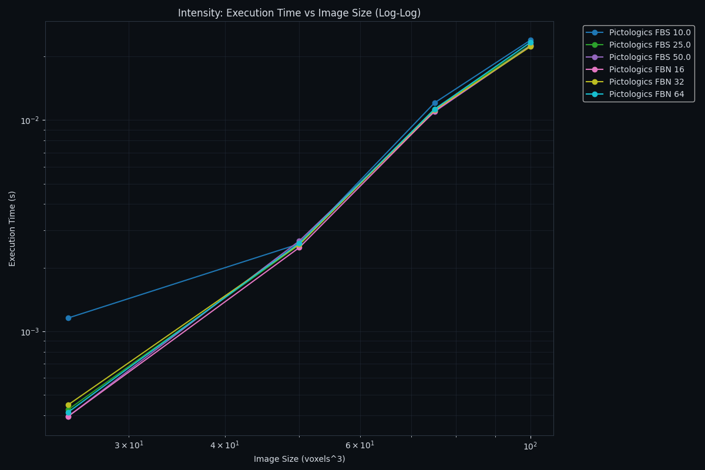
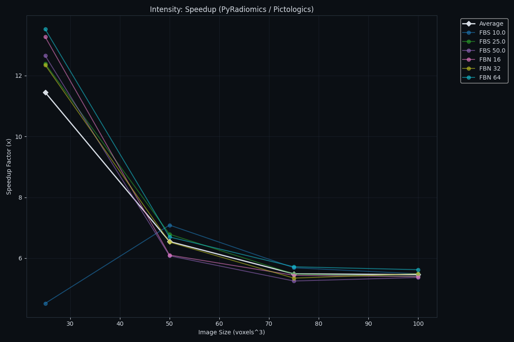
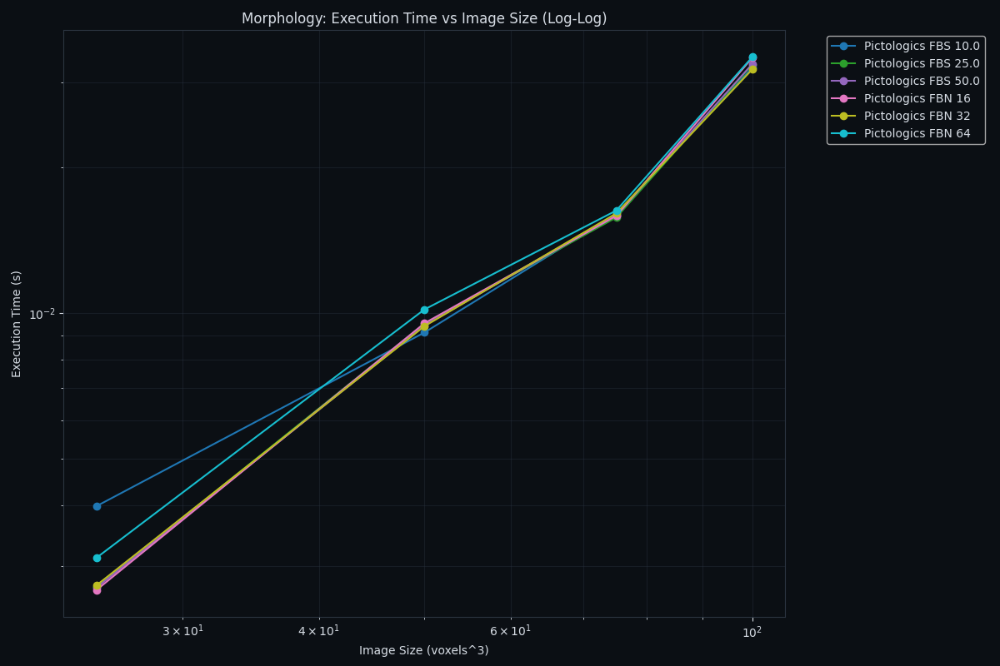
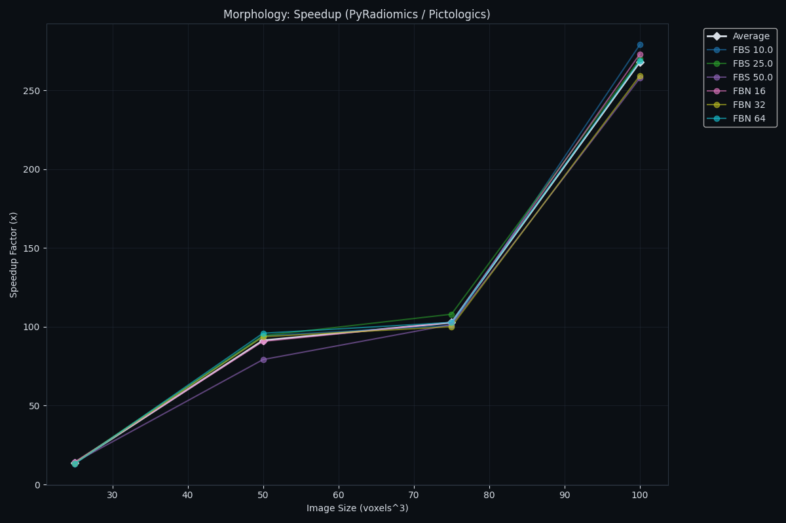
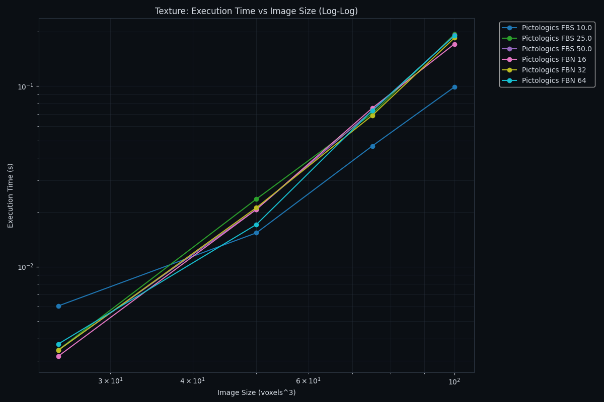
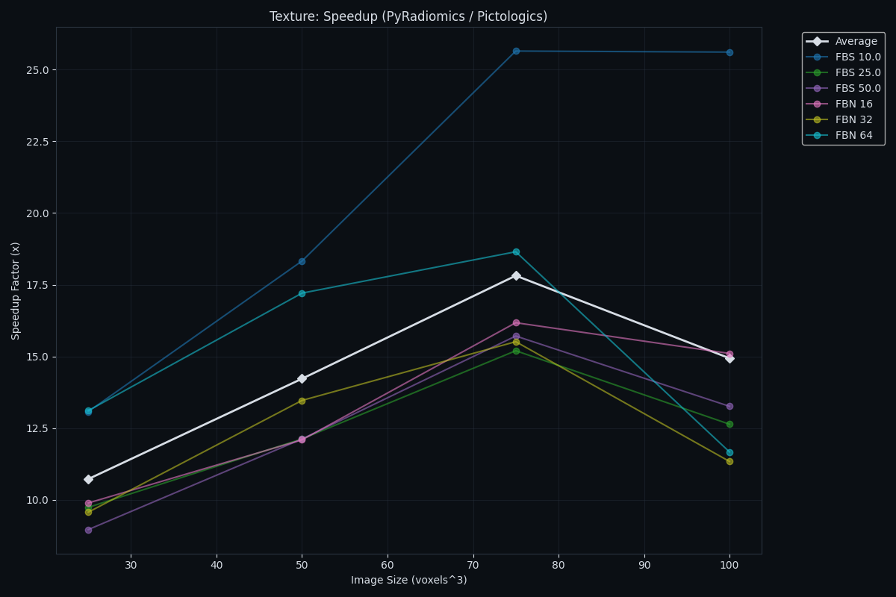
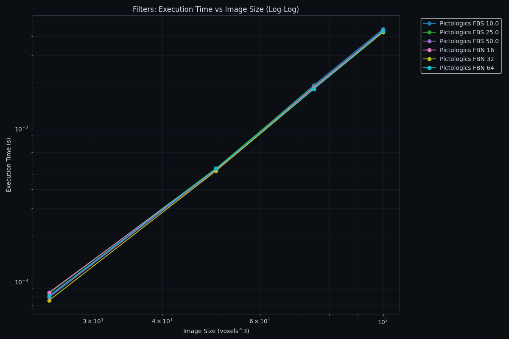
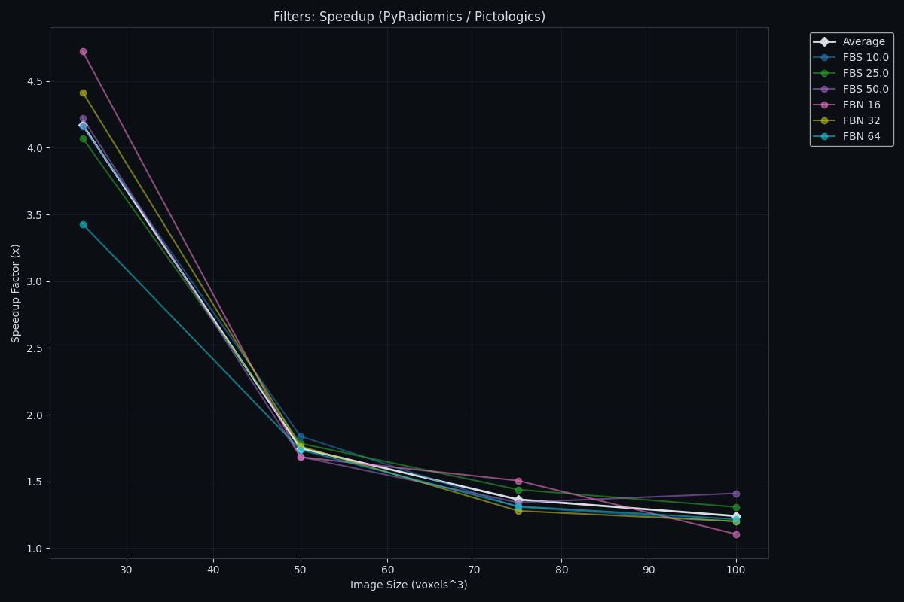

# Benchmarks

## Performance Benchmarks

### Benchmark Configuration

Comparisons between **Pictologics** and **PyRadiomics** (single-thread parity). 

**Test Data Generation:**

- **Texture**: 3D correlated noise generated using Gaussian smoothing.
- **Mask**: Blob-like structures generated via thresholded smooth noise with random holes.
- **Voxel Distribution**: Mean=486.04, Std=90.24, Min=0.00, Max=1000.00.

### HARDWARE USED FOR CALCULATIONS

- **Hardware**: Apple M4 Pro, 14 cores, 48 GB
- **OS**: macOS 26.4.1 (arm64)
- **Python**: 3.12.10
- **Core deps**: pictologics 0.4.0, numpy 2.2.6, scipy 1.17.0, numba 0.62.1, pandas 2.3.3, matplotlib 3.10.7
- **BLAS/LAPACK**: Apple Accelerate (from `numpy.show_config()`)

Note: the benchmark script explicitly calls `warmup_jit()` before timing to avoid including Numba compilation overhead in the measured runtimes. Timing and memory measurement are separated — `tracemalloc` is NOT active during timing to avoid biasing the comparison (its per-allocation hooks penalise pure-Python code more than JIT/C code). All calculations are repeated 5 times and the **mean** runtime is reported; peak memory is measured once separately.

### Intensity

| Execution Time (Log-Log) | Speedup |
|:---:|:---:|
|  |  |

**Pictologics-only intensity families (IVH + spatial/local intensity):**

|   Size | Discretization   | Pictologics-only Time   | Pictologics-only Mem   |
|-------:|:-----------------|:------------------------|:-----------------------|
|     25 | FBS 10.0         | 0.0290 s                | 0.81 MB                |
|     25 | FBS 25.0         | 0.0284 s                | 0.81 MB                |
|     25 | FBS 50.0         | 0.0294 s                | 0.81 MB                |
|     25 | FBN 16           | 0.0285 s                | 0.81 MB                |
|     25 | FBN 32           | 0.0292 s                | 0.81 MB                |
|     25 | FBN 64           | 0.0290 s                | 0.81 MB                |
|     50 | FBS 10.0         | 1.2786 s                | 6.33 MB                |
|     50 | FBS 25.0         | 1.2998 s                | 6.33 MB                |
|     50 | FBS 50.0         | 1.3098 s                | 6.33 MB                |
|     50 | FBN 16           | 1.3083 s                | 6.33 MB                |
|     50 | FBN 32           | 1.2572 s                | 6.33 MB                |
|     50 | FBN 64           | 1.2858 s                | 6.33 MB                |
|     75 | FBS 10.0         | Not calculated          | Not calculated         |
|     75 | FBS 25.0         | Not calculated          | Not calculated         |
|     75 | FBS 50.0         | Not calculated          | Not calculated         |
|     75 | FBN 16           | Not calculated          | Not calculated         |
|     75 | FBN 32           | Not calculated          | Not calculated         |
|     75 | FBN 64           | Not calculated          | Not calculated         |
|    100 | FBS 10.0         | Not calculated          | Not calculated         |
|    100 | FBS 25.0         | Not calculated          | Not calculated         |
|    100 | FBS 50.0         | Not calculated          | Not calculated         |
|    100 | FBN 16           | Not calculated          | Not calculated         |
|    100 | FBN 32           | Not calculated          | Not calculated         |
|    100 | FBN 64           | Not calculated          | Not calculated         |

### Morphology

| Execution Time (Log-Log) | Speedup |
|:---:|:---:|
|  |  |

**Pictologics-only morphology families (intensity-weighted morphology):**

|   Size | Discretization   | Pictologics-only Time   | Pictologics-only Mem   |
|-------:|:-----------------|:------------------------|:-----------------------|
|     25 | FBS 10.0         | 0.0033 s                | 1.17 MB                |
|     25 | FBS 25.0         | 0.0029 s                | 1.17 MB                |
|     25 | FBS 50.0         | 0.0027 s                | 1.17 MB                |
|     25 | FBN 16           | 0.0027 s                | 1.17 MB                |
|     25 | FBN 32           | 0.0028 s                | 1.17 MB                |
|     25 | FBN 64           | 0.0028 s                | 1.17 MB                |
|     50 | FBS 10.0         | 0.0092 s                | 5.43 MB                |
|     50 | FBS 25.0         | 0.0100 s                | 5.43 MB                |
|     50 | FBS 50.0         | 0.0092 s                | 5.43 MB                |
|     50 | FBN 16           | 0.0098 s                | 5.43 MB                |
|     50 | FBN 32           | 0.0093 s                | 5.43 MB                |
|     50 | FBN 64           | 0.0100 s                | 5.43 MB                |
|     75 | FBS 10.0         | 0.0162 s                | 8.84 MB                |
|     75 | FBS 25.0         | 0.0159 s                | 8.84 MB                |
|     75 | FBS 50.0         | 0.0159 s                | 8.84 MB                |
|     75 | FBN 16           | 0.0163 s                | 8.84 MB                |
|     75 | FBN 32           | 0.0159 s                | 8.84 MB                |
|     75 | FBN 64           | 0.0161 s                | 8.84 MB                |
|    100 | FBS 10.0         | 0.0323 s                | 20.46 MB               |
|    100 | FBS 25.0         | 0.0322 s                | 20.46 MB               |
|    100 | FBS 50.0         | 0.0324 s                | 20.46 MB               |
|    100 | FBN 16           | 0.0326 s                | 20.46 MB               |
|    100 | FBN 32           | 0.0320 s                | 20.46 MB               |
|    100 | FBN 64           | 0.0326 s                | 20.46 MB               |

### Texture

| Execution Time (Log-Log) | Speedup |
|:---:|:---:|
|  |  |

**Pictologics-only texture families (GLDZM):**

|   Size | Discretization   | Pictologics-only Time   | Pictologics-only Mem   |
|-------:|:-----------------|:------------------------|:-----------------------|
|     25 | FBS 10.0         | 0.0001 s                | 0.15 MB                |
|     25 | FBS 25.0         | 0.0001 s                | 0.13 MB                |
|     25 | FBS 50.0         | 0.0001 s                | 0.13 MB                |
|     25 | FBN 16           | 0.0000 s                | 0.13 MB                |
|     25 | FBN 32           | 0.0001 s                | 0.13 MB                |
|     25 | FBN 64           | 0.0001 s                | 0.14 MB                |
|     50 | FBS 10.0         | 0.0001 s                | 0.16 MB                |
|     50 | FBS 25.0         | 0.0001 s                | 0.14 MB                |
|     50 | FBS 50.0         | 0.0001 s                | 0.13 MB                |
|     50 | FBN 16           | 0.0001 s                | 0.13 MB                |
|     50 | FBN 32           | 0.0001 s                | 0.14 MB                |
|     50 | FBN 64           | 0.0001 s                | 0.15 MB                |
|     75 | FBS 10.0         | 0.0001 s                | 0.21 MB                |
|     75 | FBS 25.0         | 0.0001 s                | 0.16 MB                |
|     75 | FBS 50.0         | 0.0002 s                | 0.14 MB                |
|     75 | FBN 16           | 0.0001 s                | 0.14 MB                |
|     75 | FBN 32           | 0.0001 s                | 0.15 MB                |
|     75 | FBN 64           | 0.0001 s                | 0.18 MB                |
|    100 | FBS 10.0         | 0.0002 s                | 0.20 MB                |
|    100 | FBS 25.0         | 0.0002 s                | 0.16 MB                |
|    100 | FBS 50.0         | 0.0003 s                | 0.14 MB                |
|    100 | FBN 16           | 0.0002 s                | 0.14 MB                |
|    100 | FBN 32           | 0.0002 s                | 0.15 MB                |
|    100 | FBN 64           | 0.0002 s                | 0.17 MB                |

### Filters

| Execution Time (Log-Log) | Speedup |
|:---:|:---:|
|  |  |

**Pictologics-only filters (Gabor, Laws, Simoncelli, Riesz, Mean):**

|   Size | Discretization   | Pictologics-only Time   | Pictologics-only Mem   |
|-------:|:-----------------|:------------------------|:-----------------------|
|     25 | FBS 10.0         | 0.0037 s                | 1.69 MB                |
|     25 | FBS 25.0         | 0.0040 s                | 1.70 MB                |
|     25 | FBS 50.0         | 0.0039 s                | 1.70 MB                |
|     25 | FBN 16           | 0.0040 s                | 1.70 MB                |
|     25 | FBN 32           | 0.0040 s                | 1.69 MB                |
|     25 | FBN 64           | 0.0037 s                | 1.69 MB                |
|     50 | FBS 10.0         | 0.0157 s                | 13.49 MB               |
|     50 | FBS 25.0         | 0.0162 s                | 13.49 MB               |
|     50 | FBS 50.0         | 0.0159 s                | 13.49 MB               |
|     50 | FBN 16           | 0.0158 s                | 13.49 MB               |
|     50 | FBN 32           | 0.0158 s                | 13.49 MB               |
|     50 | FBN 64           | 0.0172 s                | 13.49 MB               |
|     75 | FBS 10.0         | 0.0380 s                | 45.49 MB               |
|     75 | FBS 25.0         | 0.0391 s                | 45.49 MB               |
|     75 | FBS 50.0         | 0.0403 s                | 45.49 MB               |
|     75 | FBN 16           | 0.0390 s                | 45.49 MB               |
|     75 | FBN 32           | 0.0391 s                | 45.49 MB               |
|     75 | FBN 64           | 0.0429 s                | 45.49 MB               |
|    100 | FBS 10.0         | 0.0830 s                | 107.80 MB              |
|    100 | FBS 25.0         | 0.0822 s                | 107.80 MB              |
|    100 | FBS 50.0         | 0.0857 s                | 107.80 MB              |
|    100 | FBN 16           | 0.0786 s                | 107.80 MB              |
|    100 | FBN 32           | 0.0839 s                | 107.80 MB              |
|    100 | FBN 64           | 0.0828 s                | 107.80 MB              |

### Detailed Parity Results

| Family     |   Size | Discretization   | Pictologics Time   | PyRadiomics Time   | Speedup   | Pictologics Mem   | PyRadiomics Mem   |
|:-----------|-------:|:-----------------|:-------------------|:-------------------|:----------|:------------------|:------------------|
| Filters    |     25 | FBN 16           | 0.0009 s           | N/A                | N/A       | 0.48 MB           | N/A               |
| Filters    |     25 | FBN 32           | 0.0008 s           | N/A                | N/A       | 0.48 MB           | N/A               |
| Filters    |     25 | FBN 64           | 0.0008 s           | N/A                | N/A       | 0.48 MB           | N/A               |
| Filters    |     25 | FBS 10.0         | 0.0008 s           | N/A                | N/A       | 0.48 MB           | N/A               |
| Filters    |     25 | FBS 25.0         | 0.0008 s           | N/A                | N/A       | 0.48 MB           | N/A               |
| Filters    |     25 | FBS 50.0         | 0.0008 s           | N/A                | N/A       | 0.48 MB           | N/A               |
| Filters    |     50 | FBN 16           | 0.0054 s           | N/A                | N/A       | 3.82 MB           | N/A               |
| Filters    |     50 | FBN 32           | 0.0053 s           | N/A                | N/A       | 3.82 MB           | N/A               |
| Filters    |     50 | FBN 64           | 0.0055 s           | N/A                | N/A       | 3.82 MB           | N/A               |
| Filters    |     50 | FBS 10.0         | 0.0054 s           | N/A                | N/A       | 3.82 MB           | N/A               |
| Filters    |     50 | FBS 25.0         | 0.0055 s           | N/A                | N/A       | 3.82 MB           | N/A               |
| Filters    |     50 | FBS 50.0         | 0.0054 s           | N/A                | N/A       | 3.82 MB           | N/A               |
| Filters    |     75 | FBN 16           | 0.0185 s           | N/A                | N/A       | 12.88 MB          | N/A               |
| Filters    |     75 | FBN 32           | 0.0181 s           | N/A                | N/A       | 12.88 MB          | N/A               |
| Filters    |     75 | FBN 64           | 0.0181 s           | N/A                | N/A       | 12.88 MB          | N/A               |
| Filters    |     75 | FBS 10.0         | 0.0192 s           | N/A                | N/A       | 12.88 MB          | N/A               |
| Filters    |     75 | FBS 25.0         | 0.0189 s           | N/A                | N/A       | 12.88 MB          | N/A               |
| Filters    |     75 | FBS 50.0         | 0.0187 s           | N/A                | N/A       | 12.88 MB          | N/A               |
| Filters    |    100 | FBN 16           | 0.0432 s           | N/A                | N/A       | 30.52 MB          | N/A               |
| Filters    |    100 | FBN 32           | 0.0427 s           | N/A                | N/A       | 30.52 MB          | N/A               |
| Filters    |    100 | FBN 64           | 0.0435 s           | N/A                | N/A       | 30.52 MB          | N/A               |
| Filters    |    100 | FBS 10.0         | 0.0448 s           | N/A                | N/A       | 30.52 MB          | N/A               |
| Filters    |    100 | FBS 25.0         | 0.0438 s           | N/A                | N/A       | 30.52 MB          | N/A               |
| Filters    |    100 | FBS 50.0         | 0.0440 s           | N/A                | N/A       | 30.52 MB          | N/A               |
| Intensity  |     25 | FBN 16           | 0.0004 s           | N/A                | N/A       | 0.24 MB           | N/A               |
| Intensity  |     25 | FBN 32           | 0.0004 s           | N/A                | N/A       | 0.24 MB           | N/A               |
| Intensity  |     25 | FBN 64           | 0.0004 s           | N/A                | N/A       | 0.24 MB           | N/A               |
| Intensity  |     25 | FBS 10.0         | 0.0012 s           | N/A                | N/A       | 0.24 MB           | N/A               |
| Intensity  |     25 | FBS 25.0         | 0.0004 s           | N/A                | N/A       | 0.24 MB           | N/A               |
| Intensity  |     25 | FBS 50.0         | 0.0004 s           | N/A                | N/A       | 0.24 MB           | N/A               |
| Intensity  |     50 | FBN 16           | 0.0025 s           | N/A                | N/A       | 1.40 MB           | N/A               |
| Intensity  |     50 | FBN 32           | 0.0026 s           | N/A                | N/A       | 1.40 MB           | N/A               |
| Intensity  |     50 | FBN 64           | 0.0026 s           | N/A                | N/A       | 1.40 MB           | N/A               |
| Intensity  |     50 | FBS 10.0         | 0.0026 s           | N/A                | N/A       | 1.40 MB           | N/A               |
| Intensity  |     50 | FBS 25.0         | 0.0026 s           | N/A                | N/A       | 1.40 MB           | N/A               |
| Intensity  |     50 | FBS 50.0         | 0.0027 s           | N/A                | N/A       | 1.40 MB           | N/A               |
| Intensity  |     75 | FBN 16           | 0.0110 s           | N/A                | N/A       | 5.81 MB           | N/A               |
| Intensity  |     75 | FBN 32           | 0.0112 s           | N/A                | N/A       | 5.81 MB           | N/A               |
| Intensity  |     75 | FBN 64           | 0.0113 s           | N/A                | N/A       | 5.81 MB           | N/A               |
| Intensity  |     75 | FBS 10.0         | 0.0121 s           | N/A                | N/A       | 5.81 MB           | N/A               |
| Intensity  |     75 | FBS 25.0         | 0.0113 s           | N/A                | N/A       | 5.81 MB           | N/A               |
| Intensity  |     75 | FBS 50.0         | 0.0109 s           | N/A                | N/A       | 5.81 MB           | N/A               |
| Intensity  |    100 | FBN 16           | 0.0224 s           | N/A                | N/A       | 12.16 MB          | N/A               |
| Intensity  |    100 | FBN 32           | 0.0223 s           | N/A                | N/A       | 12.16 MB          | N/A               |
| Intensity  |    100 | FBN 64           | 0.0233 s           | N/A                | N/A       | 12.16 MB          | N/A               |
| Intensity  |    100 | FBS 10.0         | 0.0239 s           | N/A                | N/A       | 12.16 MB          | N/A               |
| Intensity  |    100 | FBS 25.0         | 0.0227 s           | N/A                | N/A       | 12.16 MB          | N/A               |
| Intensity  |    100 | FBS 50.0         | 0.0224 s           | N/A                | N/A       | 12.16 MB          | N/A               |
| Morphology |     25 | FBN 16           | 0.0027 s           | N/A                | N/A       | 1.17 MB           | N/A               |
| Morphology |     25 | FBN 32           | 0.0027 s           | N/A                | N/A       | 1.17 MB           | N/A               |
| Morphology |     25 | FBN 64           | 0.0031 s           | N/A                | N/A       | 1.17 MB           | N/A               |
| Morphology |     25 | FBS 10.0         | 0.0040 s           | N/A                | N/A       | 1.17 MB           | N/A               |
| Morphology |     25 | FBS 25.0         | 0.0027 s           | N/A                | N/A       | 1.17 MB           | N/A               |
| Morphology |     25 | FBS 50.0         | 0.0027 s           | N/A                | N/A       | 1.17 MB           | N/A               |
| Morphology |     50 | FBN 16           | 0.0095 s           | N/A                | N/A       | 5.43 MB           | N/A               |
| Morphology |     50 | FBN 32           | 0.0094 s           | N/A                | N/A       | 5.43 MB           | N/A               |
| Morphology |     50 | FBN 64           | 0.0102 s           | N/A                | N/A       | 5.43 MB           | N/A               |
| Morphology |     50 | FBS 10.0         | 0.0091 s           | N/A                | N/A       | 5.43 MB           | N/A               |
| Morphology |     50 | FBS 25.0         | 0.0095 s           | N/A                | N/A       | 5.43 MB           | N/A               |
| Morphology |     50 | FBS 50.0         | 0.0094 s           | N/A                | N/A       | 5.43 MB           | N/A               |
| Morphology |     75 | FBN 16           | 0.0159 s           | N/A                | N/A       | 8.84 MB           | N/A               |
| Morphology |     75 | FBN 32           | 0.0161 s           | N/A                | N/A       | 8.84 MB           | N/A               |
| Morphology |     75 | FBN 64           | 0.0163 s           | N/A                | N/A       | 8.84 MB           | N/A               |
| Morphology |     75 | FBS 10.0         | 0.0160 s           | N/A                | N/A       | 8.84 MB           | N/A               |
| Morphology |     75 | FBS 25.0         | 0.0158 s           | N/A                | N/A       | 8.84 MB           | N/A               |
| Morphology |     75 | FBS 50.0         | 0.0159 s           | N/A                | N/A       | 8.84 MB           | N/A               |
| Morphology |    100 | FBN 16           | 0.0337 s           | N/A                | N/A       | 20.46 MB          | N/A               |
| Morphology |    100 | FBN 32           | 0.0319 s           | N/A                | N/A       | 20.46 MB          | N/A               |
| Morphology |    100 | FBN 64           | 0.0339 s           | N/A                | N/A       | 20.46 MB          | N/A               |
| Morphology |    100 | FBS 10.0         | 0.0322 s           | N/A                | N/A       | 20.46 MB          | N/A               |
| Morphology |    100 | FBS 25.0         | 0.0326 s           | N/A                | N/A       | 20.46 MB          | N/A               |
| Morphology |    100 | FBS 50.0         | 0.0328 s           | N/A                | N/A       | 20.46 MB          | N/A               |
| Texture    |     25 | FBN 16           | 0.0032 s           | N/A                | N/A       | 2.13 MB           | N/A               |
| Texture    |     25 | FBN 32           | 0.0034 s           | N/A                | N/A       | 2.07 MB           | N/A               |
| Texture    |     25 | FBN 64           | 0.0037 s           | N/A                | N/A       | 4.53 MB           | N/A               |
| Texture    |     25 | FBS 10.0         | 0.0061 s           | N/A                | N/A       | 10.10 MB          | N/A               |
| Texture    |     25 | FBS 25.0         | 0.0035 s           | N/A                | N/A       | 2.16 MB           | N/A               |
| Texture    |     25 | FBS 50.0         | 0.0035 s           | N/A                | N/A       | 2.13 MB           | N/A               |
| Texture    |     50 | FBN 16           | 0.0208 s           | N/A                | N/A       | 19.85 MB          | N/A               |
| Texture    |     50 | FBN 32           | 0.0212 s           | N/A                | N/A       | 19.95 MB          | N/A               |
| Texture    |     50 | FBN 64           | 0.0171 s           | N/A                | N/A       | 9.83 MB           | N/A               |
| Texture    |     50 | FBS 10.0         | 0.0154 s           | N/A                | N/A       | 11.96 MB          | N/A               |
| Texture    |     50 | FBS 25.0         | 0.0237 s           | N/A                | N/A       | 19.30 MB          | N/A               |
| Texture    |     50 | FBS 50.0         | 0.0208 s           | N/A                | N/A       | 21.08 MB          | N/A               |
| Texture    |     75 | FBN 16           | 0.0755 s           | N/A                | N/A       | 84.43 MB          | N/A               |
| Texture    |     75 | FBN 32           | 0.0688 s           | N/A                | N/A       | 86.59 MB          | N/A               |
| Texture    |     75 | FBN 64           | 0.0734 s           | N/A                | N/A       | 63.72 MB          | N/A               |
| Texture    |     75 | FBS 10.0         | 0.0466 s           | N/A                | N/A       | 13.36 MB          | N/A               |
| Texture    |     75 | FBS 25.0         | 0.0705 s           | N/A                | N/A       | 89.44 MB          | N/A               |
| Texture    |     75 | FBS 50.0         | 0.0731 s           | N/A                | N/A       | 88.88 MB          | N/A               |
| Texture    |    100 | FBN 16           | 0.1712 s           | N/A                | N/A       | 213.37 MB         | N/A               |
| Texture    |    100 | FBN 32           | 0.1851 s           | N/A                | N/A       | 224.11 MB         | N/A               |
| Texture    |    100 | FBN 64           | 0.1903 s           | N/A                | N/A       | 204.71 MB         | N/A               |
| Texture    |    100 | FBS 10.0         | 0.0989 s           | N/A                | N/A       | 22.17 MB          | N/A               |
| Texture    |    100 | FBS 25.0         | 0.1936 s           | N/A                | N/A       | 230.74 MB         | N/A               |
| Texture    |    100 | FBS 50.0         | 0.1911 s           | N/A                | N/A       | 229.77 MB         | N/A               |

