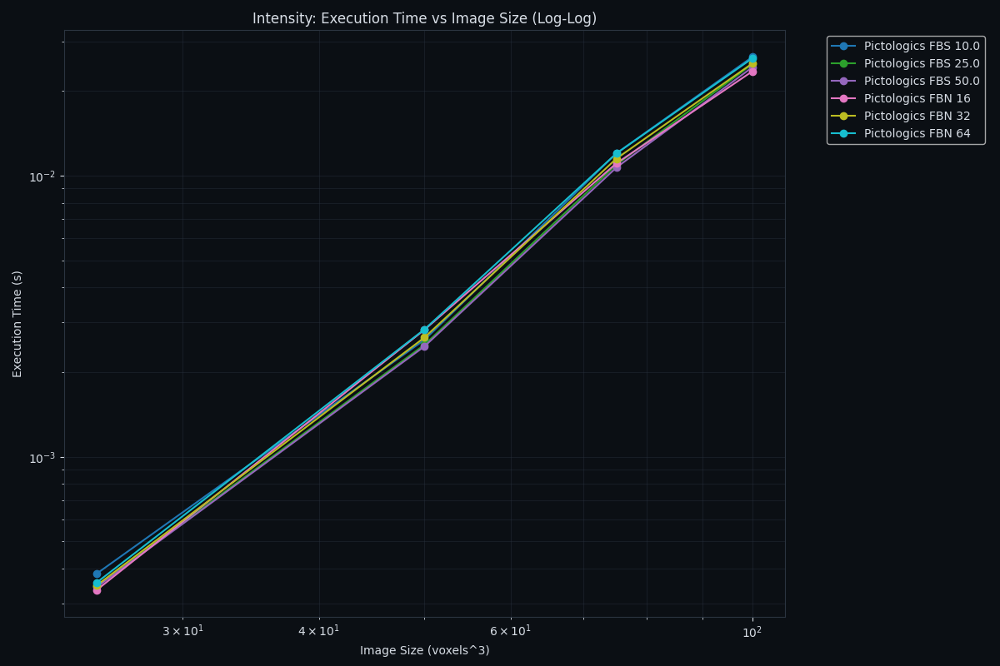
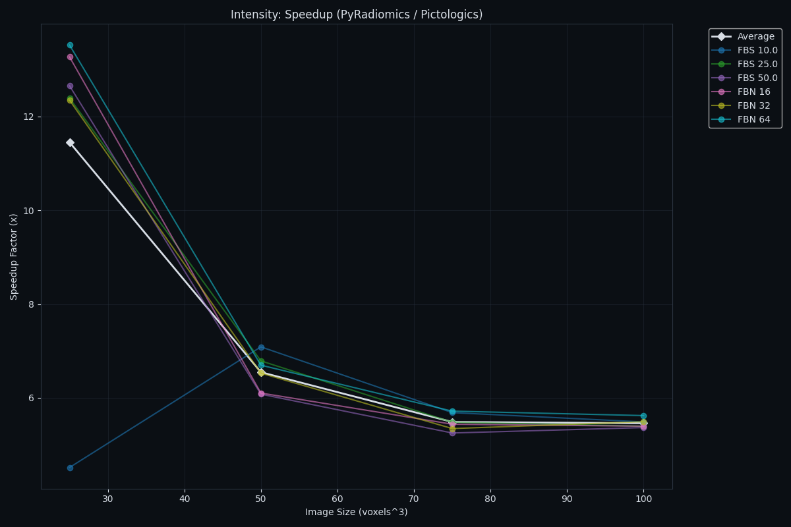
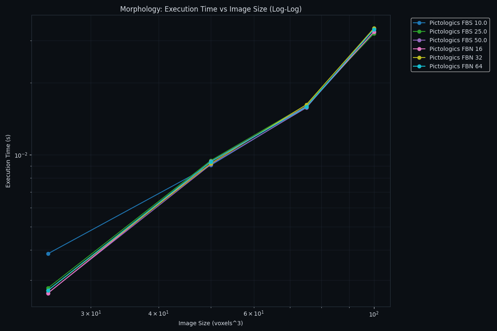
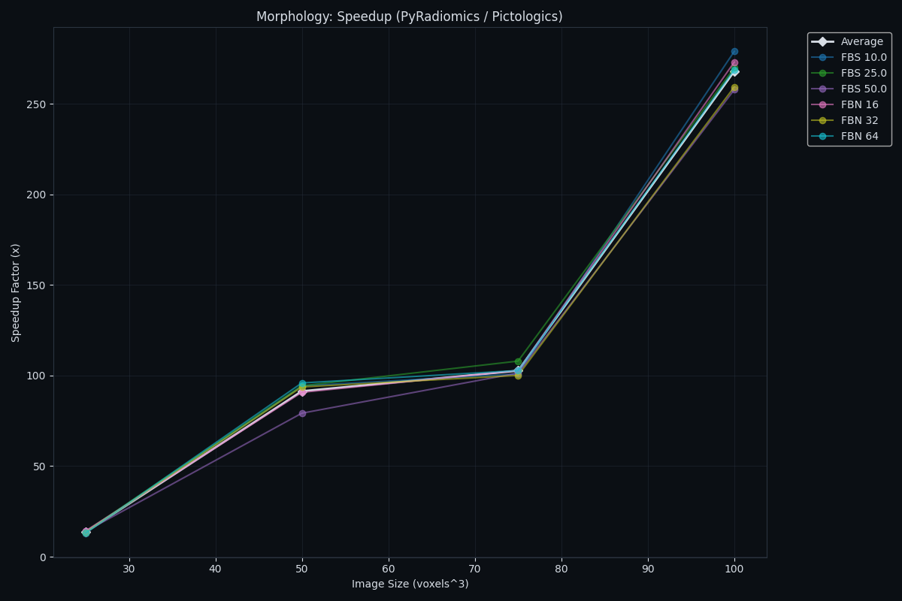
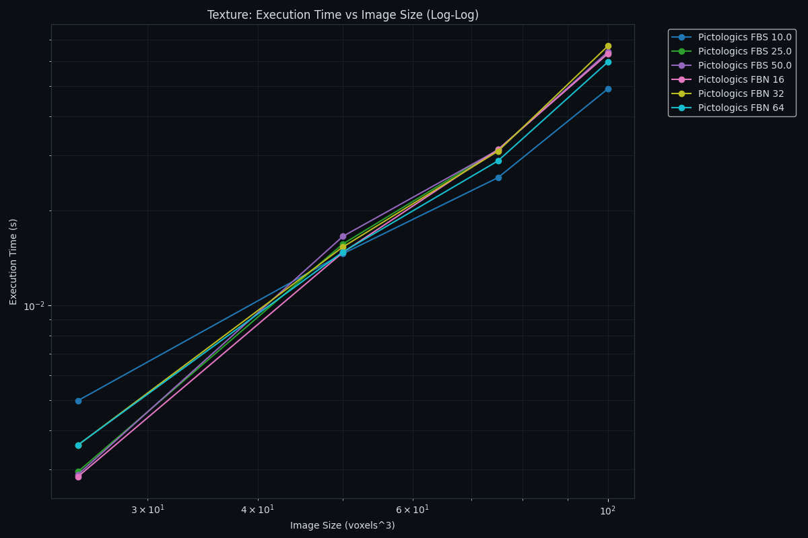
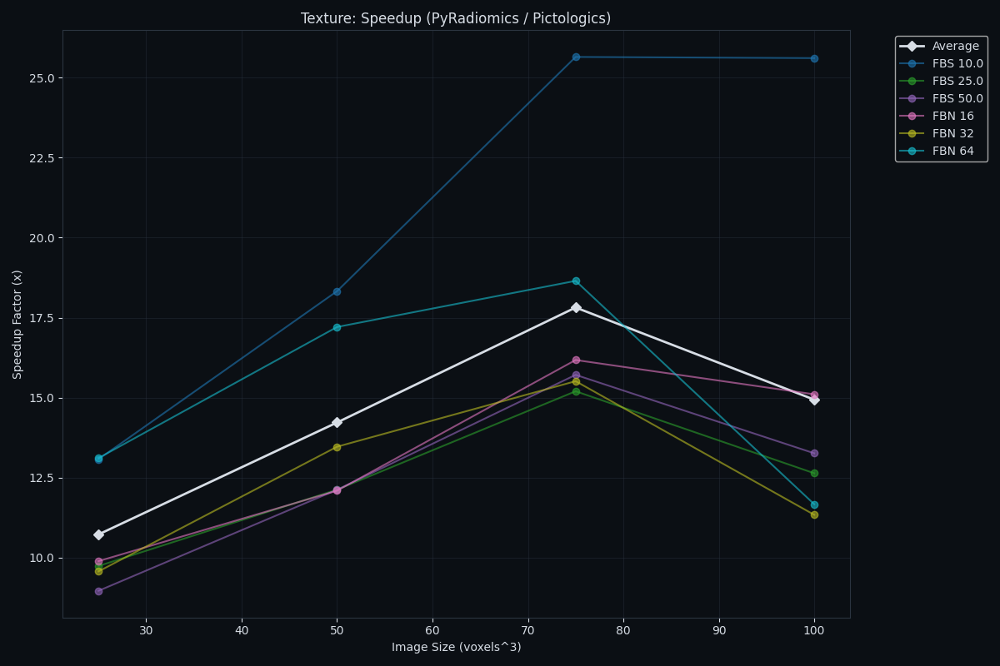
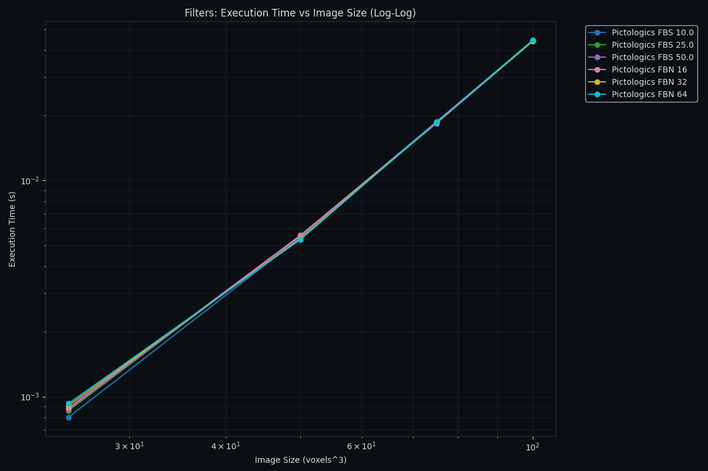
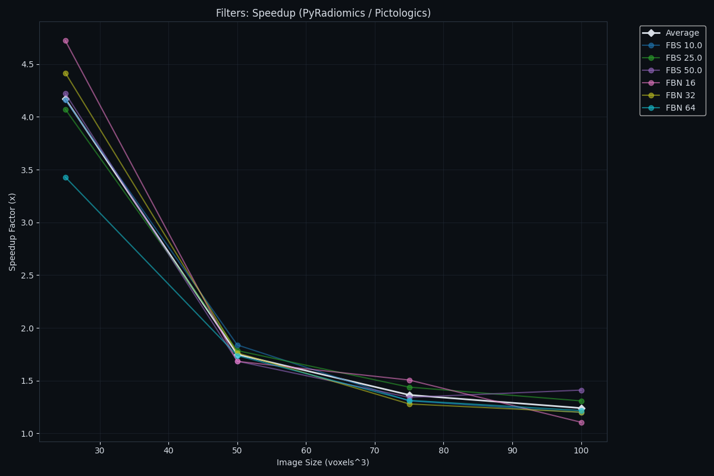

# Benchmarks

## Performance Benchmarks

### Benchmark Configuration

Comparisons between **Pictologics** and **PyRadiomics** (single-thread parity). 

**Test Data Generation:**

- **Texture**: 3D correlated noise generated using Gaussian smoothing.
- **Mask**: Blob-like structures generated via thresholded smooth noise with random holes.
- **Voxel Distribution**: Mean=486.04, Std=90.24, Min=0.00, Max=1000.00.

### HARDWARE USED FOR CALCULATIONS

- **Hardware**: Apple M4 Pro, 14 cores, 48 GB
- **OS**: macOS 26.5.2 (arm64)
- **Python**: 3.12.10
- **Core deps**: pictologics 0.5.0, numpy 2.2.6, scipy 1.17.0, numba 0.62.1, pandas 2.3.3, matplotlib 3.10.7
- **BLAS/LAPACK**: Apple Accelerate (from `numpy.show_config()`)

Note: the benchmark script explicitly calls `warmup_jit()` before timing to avoid including Numba compilation overhead in the measured runtimes. Timing and memory measurement are separated — `tracemalloc` is NOT active during timing to avoid biasing the comparison (its per-allocation hooks penalise pure-Python code more than JIT/C code). All calculations are repeated 5 times and the **mean** runtime is reported; peak memory is measured once separately.

### Intensity

| Execution Time (Log-Log) | Speedup |
|:---:|:---:|
|  |  |

**Pictologics-only intensity families (IVH + spatial/local intensity):**

|   Size | Discretization   | Pictologics-only Time   | Pictologics-only Mem   |
|-------:|:-----------------|:------------------------|:-----------------------|
|     25 | FBS 10.0         | 0.0131 s                | 1.17 MB                |
|     25 | FBS 25.0         | 0.0121 s                | 1.17 MB                |
|     25 | FBS 50.0         | 0.0123 s                | 1.17 MB                |
|     25 | FBN 16           | 0.0122 s                | 1.17 MB                |
|     25 | FBN 32           | 0.0124 s                | 1.17 MB                |
|     25 | FBN 64           | 0.0128 s                | 1.17 MB                |
|     50 | FBS 10.0         | 0.4632 s                | 9.12 MB                |
|     50 | FBS 25.0         | 0.4880 s                | 9.12 MB                |
|     50 | FBS 50.0         | 0.4776 s                | 9.12 MB                |
|     50 | FBN 16           | 0.4749 s                | 9.12 MB                |
|     50 | FBN 32           | 0.4797 s                | 9.12 MB                |
|     50 | FBN 64           | 0.4920 s                | 9.12 MB                |
|     75 | FBS 10.0         | Not calculated          | Not calculated         |
|     75 | FBS 25.0         | Not calculated          | Not calculated         |
|     75 | FBS 50.0         | Not calculated          | Not calculated         |
|     75 | FBN 16           | Not calculated          | Not calculated         |
|     75 | FBN 32           | Not calculated          | Not calculated         |
|     75 | FBN 64           | Not calculated          | Not calculated         |
|    100 | FBS 10.0         | Not calculated          | Not calculated         |
|    100 | FBS 25.0         | Not calculated          | Not calculated         |
|    100 | FBS 50.0         | Not calculated          | Not calculated         |
|    100 | FBN 16           | Not calculated          | Not calculated         |
|    100 | FBN 32           | Not calculated          | Not calculated         |
|    100 | FBN 64           | Not calculated          | Not calculated         |

### Morphology

| Execution Time (Log-Log) | Speedup |
|:---:|:---:|
|  |  |

**Pictologics-only morphology families (intensity-weighted morphology):**

|   Size | Discretization   | Pictologics-only Time   | Pictologics-only Mem   |
|-------:|:-----------------|:------------------------|:-----------------------|
|     25 | FBS 10.0         | 0.0027 s                | 1.17 MB                |
|     25 | FBS 25.0         | 0.0028 s                | 1.17 MB                |
|     25 | FBS 50.0         | 0.0027 s                | 1.17 MB                |
|     25 | FBN 16           | 0.0026 s                | 1.17 MB                |
|     25 | FBN 32           | 0.0027 s                | 1.17 MB                |
|     25 | FBN 64           | 0.0027 s                | 1.17 MB                |
|     50 | FBS 10.0         | 0.0088 s                | 5.43 MB                |
|     50 | FBS 25.0         | 0.0091 s                | 5.43 MB                |
|     50 | FBS 50.0         | 0.0092 s                | 5.43 MB                |
|     50 | FBN 16           | 0.0089 s                | 5.43 MB                |
|     50 | FBN 32           | 0.0090 s                | 5.43 MB                |
|     50 | FBN 64           | 0.0092 s                | 5.43 MB                |
|     75 | FBS 10.0         | 0.0157 s                | 8.84 MB                |
|     75 | FBS 25.0         | 0.0158 s                | 8.84 MB                |
|     75 | FBS 50.0         | 0.0157 s                | 8.84 MB                |
|     75 | FBN 16           | 0.0160 s                | 8.84 MB                |
|     75 | FBN 32           | 0.0159 s                | 8.84 MB                |
|     75 | FBN 64           | 0.0158 s                | 8.84 MB                |
|    100 | FBS 10.0         | 0.0313 s                | 20.46 MB               |
|    100 | FBS 25.0         | 0.0318 s                | 20.46 MB               |
|    100 | FBS 50.0         | 0.0323 s                | 20.46 MB               |
|    100 | FBN 16           | 0.0319 s                | 20.46 MB               |
|    100 | FBN 32           | 0.0319 s                | 20.46 MB               |
|    100 | FBN 64           | 0.0321 s                | 20.46 MB               |

### Texture

| Execution Time (Log-Log) | Speedup |
|:---:|:---:|
|  |  |

**Pictologics-only texture families (GLDZM):**

|   Size | Discretization   | Pictologics-only Time   | Pictologics-only Mem   |
|-------:|:-----------------|:------------------------|:-----------------------|
|     25 | FBS 10.0         | 0.0001 s                | 0.04 MB                |
|     25 | FBS 25.0         | 0.0000 s                | 0.01 MB                |
|     25 | FBS 50.0         | 0.0000 s                | 0.01 MB                |
|     25 | FBN 16           | 0.0000 s                | 0.00 MB                |
|     25 | FBN 32           | 0.0000 s                | 0.01 MB                |
|     25 | FBN 64           | 0.0000 s                | 0.02 MB                |
|     50 | FBS 10.0         | 0.0001 s                | 0.07 MB                |
|     50 | FBS 25.0         | 0.0001 s                | 0.03 MB                |
|     50 | FBS 50.0         | 0.0001 s                | 0.01 MB                |
|     50 | FBN 16           | 0.0001 s                | 0.01 MB                |
|     50 | FBN 32           | 0.0001 s                | 0.02 MB                |
|     50 | FBN 64           | 0.0001 s                | 0.05 MB                |
|     75 | FBS 10.0         | 0.0001 s                | 0.16 MB                |
|     75 | FBS 25.0         | 0.0001 s                | 0.07 MB                |
|     75 | FBS 50.0         | 0.0001 s                | 0.03 MB                |
|     75 | FBN 16           | 0.0001 s                | 0.03 MB                |
|     75 | FBN 32           | 0.0001 s                | 0.05 MB                |
|     75 | FBN 64           | 0.0001 s                | 0.11 MB                |
|    100 | FBS 10.0         | 0.0001 s                | 0.16 MB                |
|    100 | FBS 25.0         | 0.0001 s                | 0.06 MB                |
|    100 | FBS 50.0         | 0.0001 s                | 0.03 MB                |
|    100 | FBN 16           | 0.0001 s                | 0.02 MB                |
|    100 | FBN 32           | 0.0001 s                | 0.05 MB                |
|    100 | FBN 64           | 0.0001 s                | 0.10 MB                |

### Filters

| Execution Time (Log-Log) | Speedup |
|:---:|:---:|
|  |  |

**Pictologics-only filters (Gabor, Laws, Simoncelli, Riesz, Mean):**

|   Size | Discretization   | Pictologics-only Time   | Pictologics-only Mem   |
|-------:|:-----------------|:------------------------|:-----------------------|
|     25 | FBS 10.0         | 0.0032 s                | 0.78 MB                |
|     25 | FBS 25.0         | 0.0033 s                | 0.78 MB                |
|     25 | FBS 50.0         | 0.0036 s                | 0.78 MB                |
|     25 | FBN 16           | 0.0030 s                | 0.78 MB                |
|     25 | FBN 32           | 0.0031 s                | 0.78 MB                |
|     25 | FBN 64           | 0.0028 s                | 0.78 MB                |
|     50 | FBS 10.0         | 0.0103 s                | 6.21 MB                |
|     50 | FBS 25.0         | 0.0098 s                | 6.21 MB                |
|     50 | FBS 50.0         | 0.0112 s                | 6.21 MB                |
|     50 | FBN 16           | 0.0097 s                | 6.21 MB                |
|     50 | FBN 32           | 0.0110 s                | 6.21 MB                |
|     50 | FBN 64           | 0.0103 s                | 6.21 MB                |
|     75 | FBS 10.0         | 0.0225 s                | 20.94 MB               |
|     75 | FBS 25.0         | 0.0214 s                | 20.94 MB               |
|     75 | FBS 50.0         | 0.0221 s                | 20.94 MB               |
|     75 | FBN 16           | 0.0219 s                | 20.94 MB               |
|     75 | FBN 32           | 0.0220 s                | 20.94 MB               |
|     75 | FBN 64           | 0.0227 s                | 20.94 MB               |
|    100 | FBS 10.0         | 0.0452 s                | 49.61 MB               |
|    100 | FBS 25.0         | 0.0415 s                | 49.61 MB               |
|    100 | FBS 50.0         | 0.0421 s                | 49.61 MB               |
|    100 | FBN 16           | 0.0431 s                | 49.61 MB               |
|    100 | FBN 32           | 0.0493 s                | 49.62 MB               |
|    100 | FBN 64           | 0.0427 s                | 49.62 MB               |

### Detailed Parity Results

| Family     |   Size | Discretization   | Pictologics Time   | PyRadiomics Time   | Speedup   | Pictologics Mem   | PyRadiomics Mem   |
|:-----------|-------:|:-----------------|:-------------------|:-------------------|:----------|:------------------|:------------------|
| Filters    |     25 | FBN 16           | 0.0009 s           | N/A                | N/A       | 0.37 MB           | N/A               |
| Filters    |     25 | FBN 32           | 0.0008 s           | N/A                | N/A       | 0.37 MB           | N/A               |
| Filters    |     25 | FBN 64           | 0.0008 s           | N/A                | N/A       | 0.37 MB           | N/A               |
| Filters    |     25 | FBS 10.0         | 0.0008 s           | N/A                | N/A       | 0.37 MB           | N/A               |
| Filters    |     25 | FBS 25.0         | 0.0010 s           | N/A                | N/A       | 0.37 MB           | N/A               |
| Filters    |     25 | FBS 50.0         | 0.0008 s           | N/A                | N/A       | 0.37 MB           | N/A               |
| Filters    |     50 | FBN 16           | 0.0053 s           | N/A                | N/A       | 2.87 MB           | N/A               |
| Filters    |     50 | FBN 32           | 0.0057 s           | N/A                | N/A       | 2.87 MB           | N/A               |
| Filters    |     50 | FBN 64           | 0.0055 s           | N/A                | N/A       | 2.87 MB           | N/A               |
| Filters    |     50 | FBS 10.0         | 0.0052 s           | N/A                | N/A       | 2.87 MB           | N/A               |
| Filters    |     50 | FBS 25.0         | 0.0056 s           | N/A                | N/A       | 2.87 MB           | N/A               |
| Filters    |     50 | FBS 50.0         | 0.0058 s           | N/A                | N/A       | 2.87 MB           | N/A               |
| Filters    |     75 | FBN 16           | 0.0189 s           | N/A                | N/A       | 9.66 MB           | N/A               |
| Filters    |     75 | FBN 32           | 0.0184 s           | N/A                | N/A       | 9.66 MB           | N/A               |
| Filters    |     75 | FBN 64           | 0.0185 s           | N/A                | N/A       | 9.66 MB           | N/A               |
| Filters    |     75 | FBS 10.0         | 0.0182 s           | N/A                | N/A       | 9.66 MB           | N/A               |
| Filters    |     75 | FBS 25.0         | 0.0182 s           | N/A                | N/A       | 9.66 MB           | N/A               |
| Filters    |     75 | FBS 50.0         | 0.0184 s           | N/A                | N/A       | 9.66 MB           | N/A               |
| Filters    |    100 | FBN 16           | 0.0430 s           | N/A                | N/A       | 22.90 MB          | N/A               |
| Filters    |    100 | FBN 32           | 0.0430 s           | N/A                | N/A       | 22.90 MB          | N/A               |
| Filters    |    100 | FBN 64           | 0.0436 s           | N/A                | N/A       | 22.90 MB          | N/A               |
| Filters    |    100 | FBS 10.0         | 0.0427 s           | N/A                | N/A       | 22.90 MB          | N/A               |
| Filters    |    100 | FBS 25.0         | 0.0430 s           | N/A                | N/A       | 22.90 MB          | N/A               |
| Filters    |    100 | FBS 50.0         | 0.0435 s           | N/A                | N/A       | 22.90 MB          | N/A               |
| Intensity  |     25 | FBN 16           | 0.0003 s           | N/A                | N/A       | 0.17 MB           | N/A               |
| Intensity  |     25 | FBN 32           | 0.0003 s           | N/A                | N/A       | 0.17 MB           | N/A               |
| Intensity  |     25 | FBN 64           | 0.0004 s           | N/A                | N/A       | 0.17 MB           | N/A               |
| Intensity  |     25 | FBS 10.0         | 0.0004 s           | N/A                | N/A       | 0.17 MB           | N/A               |
| Intensity  |     25 | FBS 25.0         | 0.0003 s           | N/A                | N/A       | 0.17 MB           | N/A               |
| Intensity  |     25 | FBS 50.0         | 0.0003 s           | N/A                | N/A       | 0.17 MB           | N/A               |
| Intensity  |     50 | FBN 16           | 0.0028 s           | N/A                | N/A       | 0.73 MB           | N/A               |
| Intensity  |     50 | FBN 32           | 0.0027 s           | N/A                | N/A       | 0.73 MB           | N/A               |
| Intensity  |     50 | FBN 64           | 0.0028 s           | N/A                | N/A       | 0.73 MB           | N/A               |
| Intensity  |     50 | FBS 10.0         | 0.0026 s           | N/A                | N/A       | 0.73 MB           | N/A               |
| Intensity  |     50 | FBS 25.0         | 0.0025 s           | N/A                | N/A       | 0.73 MB           | N/A               |
| Intensity  |     50 | FBS 50.0         | 0.0025 s           | N/A                | N/A       | 0.73 MB           | N/A               |
| Intensity  |     75 | FBN 16           | 0.0110 s           | N/A                | N/A       | 2.94 MB           | N/A               |
| Intensity  |     75 | FBN 32           | 0.0115 s           | N/A                | N/A       | 2.94 MB           | N/A               |
| Intensity  |     75 | FBN 64           | 0.0120 s           | N/A                | N/A       | 2.94 MB           | N/A               |
| Intensity  |     75 | FBS 10.0         | 0.0120 s           | N/A                | N/A       | 2.94 MB           | N/A               |
| Intensity  |     75 | FBS 25.0         | 0.0109 s           | N/A                | N/A       | 2.94 MB           | N/A               |
| Intensity  |     75 | FBS 50.0         | 0.0107 s           | N/A                | N/A       | 2.94 MB           | N/A               |
| Intensity  |    100 | FBN 16           | 0.0235 s           | N/A                | N/A       | 6.11 MB           | N/A               |
| Intensity  |    100 | FBN 32           | 0.0250 s           | N/A                | N/A       | 6.11 MB           | N/A               |
| Intensity  |    100 | FBN 64           | 0.0261 s           | N/A                | N/A       | 6.11 MB           | N/A               |
| Intensity  |    100 | FBS 10.0         | 0.0264 s           | N/A                | N/A       | 6.11 MB           | N/A               |
| Intensity  |    100 | FBS 25.0         | 0.0249 s           | N/A                | N/A       | 6.11 MB           | N/A               |
| Intensity  |    100 | FBS 50.0         | 0.0243 s           | N/A                | N/A       | 6.11 MB           | N/A               |
| Morphology |     25 | FBN 16           | 0.0026 s           | N/A                | N/A       | 1.17 MB           | N/A               |
| Morphology |     25 | FBN 32           | 0.0027 s           | N/A                | N/A       | 1.17 MB           | N/A               |
| Morphology |     25 | FBN 64           | 0.0029 s           | N/A                | N/A       | 1.17 MB           | N/A               |
| Morphology |     25 | FBS 10.0         | 0.0041 s           | N/A                | N/A       | 1.17 MB           | N/A               |
| Morphology |     25 | FBS 25.0         | 0.0030 s           | N/A                | N/A       | 1.17 MB           | N/A               |
| Morphology |     25 | FBS 50.0         | 0.0028 s           | N/A                | N/A       | 1.17 MB           | N/A               |
| Morphology |     50 | FBN 16           | 0.0089 s           | N/A                | N/A       | 5.43 MB           | N/A               |
| Morphology |     50 | FBN 32           | 0.0089 s           | N/A                | N/A       | 5.43 MB           | N/A               |
| Morphology |     50 | FBN 64           | 0.0093 s           | N/A                | N/A       | 5.43 MB           | N/A               |
| Morphology |     50 | FBS 10.0         | 0.0088 s           | N/A                | N/A       | 5.43 MB           | N/A               |
| Morphology |     50 | FBS 25.0         | 0.0091 s           | N/A                | N/A       | 5.43 MB           | N/A               |
| Morphology |     50 | FBS 50.0         | 0.0088 s           | N/A                | N/A       | 5.43 MB           | N/A               |
| Morphology |     75 | FBN 16           | 0.0156 s           | N/A                | N/A       | 8.84 MB           | N/A               |
| Morphology |     75 | FBN 32           | 0.0159 s           | N/A                | N/A       | 8.84 MB           | N/A               |
| Morphology |     75 | FBN 64           | 0.0161 s           | N/A                | N/A       | 8.84 MB           | N/A               |
| Morphology |     75 | FBS 10.0         | 0.0159 s           | N/A                | N/A       | 8.84 MB           | N/A               |
| Morphology |     75 | FBS 25.0         | 0.0156 s           | N/A                | N/A       | 8.84 MB           | N/A               |
| Morphology |     75 | FBS 50.0         | 0.0156 s           | N/A                | N/A       | 8.84 MB           | N/A               |
| Morphology |    100 | FBN 16           | 0.0319 s           | N/A                | N/A       | 20.46 MB          | N/A               |
| Morphology |    100 | FBN 32           | 0.0317 s           | N/A                | N/A       | 20.46 MB          | N/A               |
| Morphology |    100 | FBN 64           | 0.0318 s           | N/A                | N/A       | 20.46 MB          | N/A               |
| Morphology |    100 | FBS 10.0         | 0.0315 s           | N/A                | N/A       | 20.46 MB          | N/A               |
| Morphology |    100 | FBS 25.0         | 0.0318 s           | N/A                | N/A       | 20.46 MB          | N/A               |
| Morphology |    100 | FBS 50.0         | 0.0320 s           | N/A                | N/A       | 20.46 MB          | N/A               |
| Texture    |     25 | FBN 16           | 0.0024 s           | N/A                | N/A       | 0.55 MB           | N/A               |
| Texture    |     25 | FBN 32           | 0.0027 s           | N/A                | N/A       | 1.47 MB           | N/A               |
| Texture    |     25 | FBN 64           | 0.0035 s           | N/A                | N/A       | 4.54 MB           | N/A               |
| Texture    |     25 | FBS 10.0         | 0.0052 s           | N/A                | N/A       | 10.12 MB          | N/A               |
| Texture    |     25 | FBS 25.0         | 0.0027 s           | N/A                | N/A       | 2.17 MB           | N/A               |
| Texture    |     25 | FBS 50.0         | 0.0028 s           | N/A                | N/A       | 0.80 MB           | N/A               |
| Texture    |     50 | FBN 16           | 0.0114 s           | N/A                | N/A       | 2.29 MB           | N/A               |
| Texture    |     50 | FBN 32           | 0.0121 s           | N/A                | N/A       | 2.45 MB           | N/A               |
| Texture    |     50 | FBN 64           | 0.0126 s           | N/A                | N/A       | 5.86 MB           | N/A               |
| Texture    |     50 | FBS 10.0         | 0.0134 s           | N/A                | N/A       | 12.08 MB          | N/A               |
| Texture    |     50 | FBS 25.0         | 0.0122 s           | N/A                | N/A       | 3.09 MB           | N/A               |
| Texture    |     50 | FBS 50.0         | 0.0125 s           | N/A                | N/A       | 2.41 MB           | N/A               |
| Texture    |     75 | FBN 16           | 0.0274 s           | N/A                | N/A       | 10.20 MB          | N/A               |
| Texture    |     75 | FBN 32           | 0.0263 s           | N/A                | N/A       | 10.40 MB          | N/A               |
| Texture    |     75 | FBN 64           | 0.0262 s           | N/A                | N/A       | 10.95 MB          | N/A               |
| Texture    |     75 | FBS 10.0         | 0.0232 s           | N/A                | N/A       | 13.76 MB          | N/A               |
| Texture    |     75 | FBS 25.0         | 0.0269 s           | N/A                | N/A       | 10.67 MB          | N/A               |
| Texture    |     75 | FBS 50.0         | 0.0276 s           | N/A                | N/A       | 10.36 MB          | N/A               |
| Texture    |    100 | FBN 16           | 0.0497 s           | N/A                | N/A       | 23.99 MB          | N/A               |
| Texture    |    100 | FBN 32           | 0.0540 s           | N/A                | N/A       | 24.97 MB          | N/A               |
| Texture    |    100 | FBN 64           | 0.0500 s           | N/A                | N/A       | 24.33 MB          | N/A               |
| Texture    |    100 | FBS 10.0         | 0.0439 s           | N/A                | N/A       | 25.14 MB          | N/A               |
| Texture    |    100 | FBS 25.0         | 0.0558 s           | N/A                | N/A       | 25.57 MB          | N/A               |
| Texture    |    100 | FBS 50.0         | 0.0543 s           | N/A                | N/A       | 25.15 MB          | N/A               |

