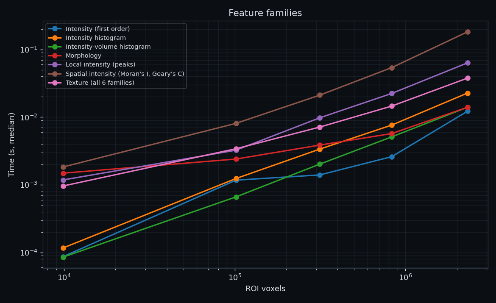
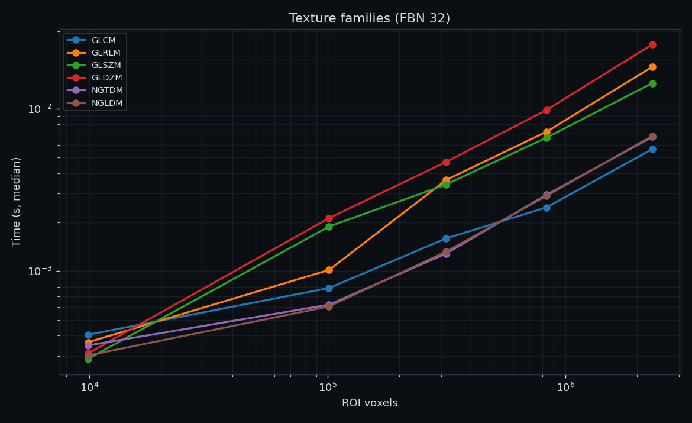
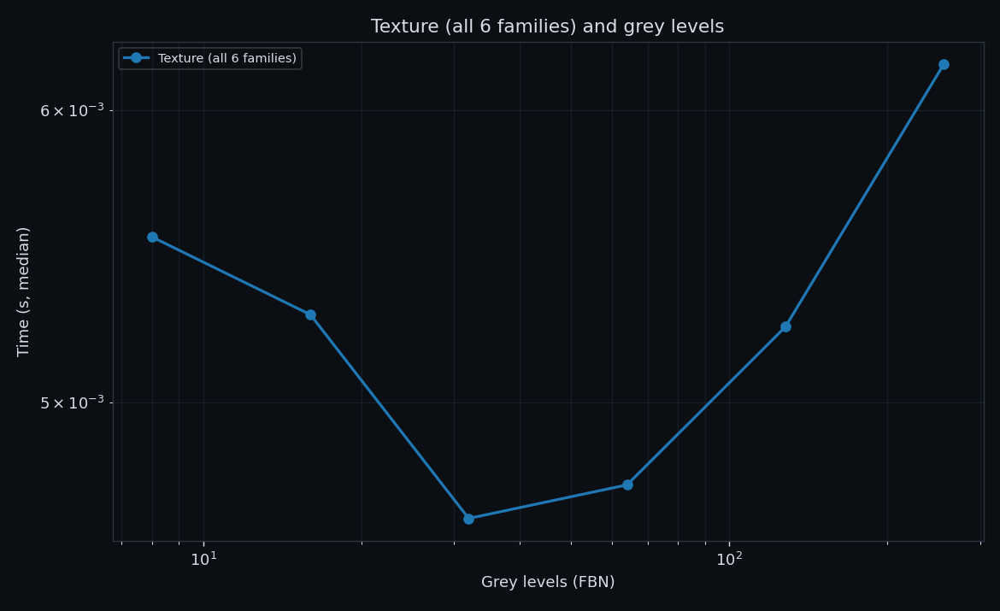
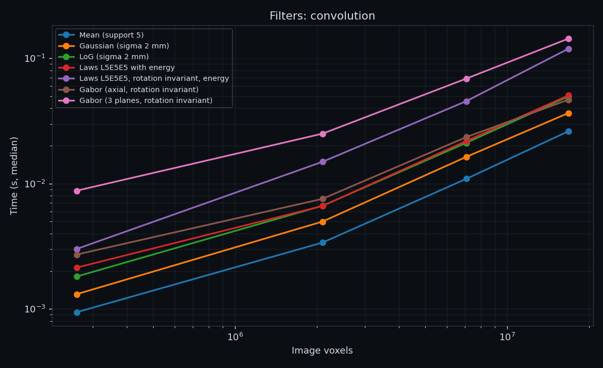
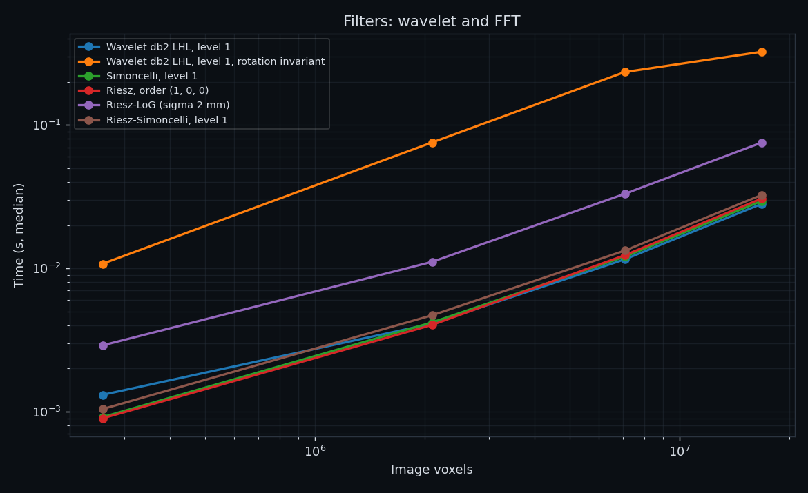
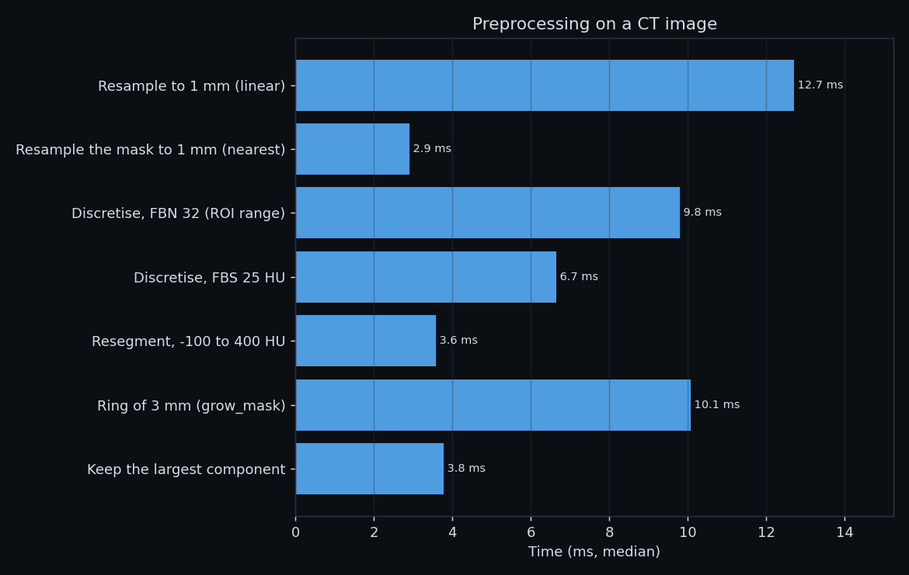
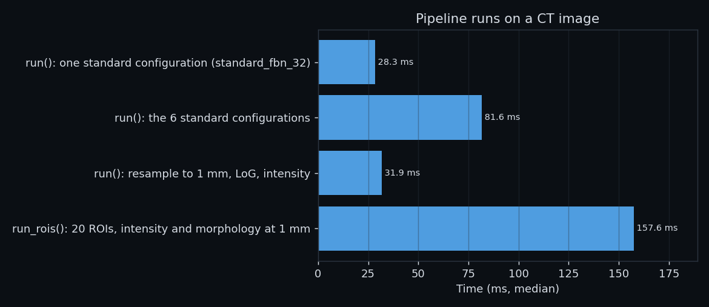
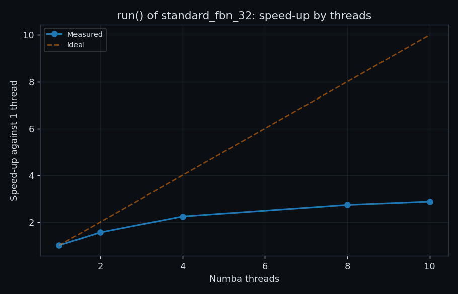
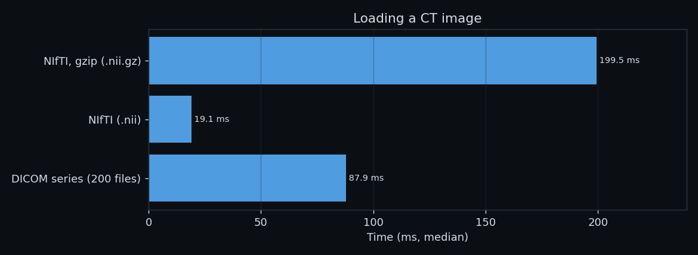

# Benchmarks

## Speed of Pictologics

This page gives the speed of Pictologics 0.7.1 on one computer. A later version of this page will compare more programs, data sets and computers.

!!! info "How we measured"
    - **Data**: synthetic and seeded. Correlated noise with blob-shaped ROIs (with holes) for the features; normal noise cubes of 1 mm voxels for the filters; a CT-like image of 512 × 512 × 200 voxels (0.7 × 0.7 × 1.25 mm: air, a body of soft tissue with noise, a lesion of 20 mm radius of 54,746 voxels) for the preprocessing, the pipeline and the loaders.
    - **Time**: the wall-clock time of one call, the median of 5 runs after one warm-up run (the warm-up compiles the numba code). The tables give the median; the list tables also give the fastest and the slowest run.
    - **Threads**: numba uses 10 threads (the default of Pictologics on this computer), except in the thread test.
    - **Features**: the feature functions on their own, without the pipeline. The texture rows use FBN 32, except in the grey level table.

### Computer and Software

- **Hardware**: Apple M4 Pro, 14 cores, 48 GB
- **OS**: macOS 27.0.1 (arm64)
- **Python**: 3.12.10
- **Core deps**: pictologics 0.7.1, numpy 2.5.3, scipy 1.17.0, numba 0.67.0, pandas 2.3.3, matplotlib 3.10.7
- **BLAS/LAPACK**: Apple Accelerate (from `numpy.show_config()`)
- **Numba threads**: 10

### Feature Families

ROI cubes: 25³ (9,861 ROI voxels), 50³ (101,638 ROI voxels), 75³ (315,151 ROI voxels), 100³ (830,970 ROI voxels), 150³ (2,311,384 ROI voxels).

| Task | 25³ | 50³ | 75³ | 100³ | 150³ |
|:--|--:|--:|--:|--:|--:|
| Intensity (first order) | 0.1 ms | 0.2 ms | 0.7 ms | 1.7 ms | 3.6 ms |
| Intensity histogram | 0.1 ms | 1.4 ms | 3.5 ms | 7.8 ms | 21.5 ms |
| Intensity-volume histogram | 0.1 ms | 0.7 ms | 1.9 ms | 5.3 ms | 14.5 ms |
| Morphology | 0.6 ms | 1.8 ms | 2.8 ms | 4.4 ms | 9.9 ms |
| Local intensity (peaks) | 1.3 ms | 3.2 ms | 9.4 ms | 23.4 ms | 71.0 ms |
| Spatial intensity (Moran's I, Geary's C) | 1.5 ms | 8.3 ms | 24.3 ms | 58.3 ms | 179.7 ms |
| Texture (all 6 families) | 1.0 ms | 2.6 ms | 5.4 ms | 9.8 ms | 27.1 ms |

### Texture Families

Each family on its own (`calculate_all_texture_features(..., families=[...])`), FBN 32.

| Task | 25³ | 50³ | 75³ | 100³ | 150³ |
|:--|--:|--:|--:|--:|--:|
| GLCM | 0.3 ms | 0.8 ms | 1.2 ms | 2.1 ms | 5.4 ms |
| GLRLM | 0.3 ms | 0.8 ms | 1.7 ms | 3.6 ms | 10.3 ms |
| GLSZM | 0.3 ms | 1.0 ms | 1.8 ms | 3.4 ms | 9.7 ms |
| GLDZM | 0.3 ms | 1.3 ms | 2.3 ms | 4.9 ms | 10.7 ms |
| NGTDM | 0.2 ms | 0.4 ms | 0.7 ms | 0.9 ms | 2.2 ms |
| NGLDM | 0.3 ms | 0.4 ms | 0.6 ms | 0.9 ms | 2.3 ms |

### Texture and Grey Levels

All six texture families on the 75³ cube (315,151 ROI voxels) with FBN discretisation.

| Task | 8 levels | 16 levels | 32 levels | 64 levels | 128 levels | 256 levels |
|:--|--:|--:|--:|--:|--:|--:|
| Texture (all 6 families) | 5.5 ms | 5.3 ms | 4.7 ms | 4.7 ms | 5.2 ms | 6.2 ms |

### Filters

Image cubes of 1 mm voxels. Convolution filters use the mirror boundary; the FFT filters (Simoncelli, Riesz) use their periodic default.

| Task | 64³ | 128³ | 192³ | 256³ |
|:--|--:|--:|--:|--:|
| Mean (support 5) | 0.9 ms | 3.4 ms | 10.9 ms | 26.2 ms |
| Gaussian (sigma 2 mm) | 1.3 ms | 5.0 ms | 16.3 ms | 36.6 ms |
| LoG (sigma 2 mm) | 1.8 ms | 6.7 ms | 21.2 ms | 49.6 ms |
| Laws L5E5E5 with energy | 2.1 ms | 6.6 ms | 21.9 ms | 50.6 ms |
| Laws L5E5E5, rotation invariant, energy | 3.0 ms | 14.9 ms | 45.5 ms | 119.2 ms |
| Gabor (axial, rotation invariant) | 2.7 ms | 7.6 ms | 23.5 ms | 46.7 ms |
| Gabor (3 planes, rotation invariant) | 8.8 ms | 25.0 ms | 68.9 ms | 143.5 ms |
| Wavelet db2 LHL, level 1 | 1.0 ms | 3.7 ms | 10.6 ms | 27.4 ms |
| Wavelet db2 LHL, level 1, rotation invariant | 9.8 ms | 73.1 ms | 234.6 ms | 298.3 ms |
| Simoncelli, level 1 | 1.0 ms | 4.0 ms | 12.0 ms | 30.8 ms |
| Riesz, order (1, 0, 0) | 1.0 ms | 4.1 ms | 11.7 ms | 32.1 ms |
| Riesz-LoG (sigma 2 mm) | 3.2 ms | 10.8 ms | 32.1 ms | 76.7 ms |
| Riesz-Simoncelli, level 1 | 1.2 ms | 4.1 ms | 12.3 ms | 31.0 ms |

### Preprocessing

The functions of `pictologics.preprocessing` on the CT-like image.

| Task | Time (median) | Fastest | Slowest |
|:--|--:|--:|--:|
| Resample to 1 mm (linear) | 11.4 ms | 11.3 ms | 15.8 ms |
| Resample the mask to 1 mm (nearest) | 2.7 ms | 2.7 ms | 3.9 ms |
| Discretise, FBN 32 (ROI range) | 10.4 ms | 8.8 ms | 11.3 ms |
| Discretise, FBS 25 HU | 6.1 ms | 6.1 ms | 7.3 ms |
| Resegment, -100 to 400 HU | 3.2 ms | 3.1 ms | 3.3 ms |
| Ring of 3 mm (grow_mask) | 9.0 ms | 8.9 ms | 9.3 ms |
| Keep the largest component | 3.1 ms | 2.8 ms | 3.8 ms |

### Pipeline

Whole pipeline runs on the CT-like image, from the image in memory to the feature Series. The standard configurations resample to 0.5 mm and compute the intensity, morphology, texture, histogram and IVH features; the pipeline resamples only the region around the ROI. The 20 ROIs of `run_rois` are spheres of 8 mm radius.

| Task | Time (median) | Fastest | Slowest |
|:--|--:|--:|--:|
| run(): one standard configuration (standard_fbn_32) | 11.3 ms | 10.8 ms | 11.4 ms |
| run(): the 6 standard configurations | 43.4 ms | 42.8 ms | 44.3 ms |
| run(): resample to 1 mm, LoG, intensity | 29.6 ms | 29.0 ms | 33.0 ms |
| run_rois(): 20 ROIs, intensity and morphology at 1 mm | 17.6 ms | 17.3 ms | 18.2 ms |

### Threads

`run()` of `standard_fbn_32` on the CT-like image with 1 to 10 numba threads.

| Task | Time (median) | Fastest | Slowest |
|:--|--:|--:|--:|
| 1 thread | 27.6 ms | 27.4 ms | 28.1 ms |
| 2 threads | 17.9 ms | 17.5 ms | 18.1 ms |
| 4 threads | 12.9 ms | 12.3 ms | 13.2 ms |
| 8 threads | 10.3 ms | 10.1 ms | 10.9 ms |
| 10 threads | 10.5 ms | 10.1 ms | 11.3 ms |

### Loading

`load_image` of the CT-like image (int16 values), from a temporary folder on the internal disk.

| Task | Time (median) | Fastest | Slowest |
|:--|--:|--:|--:|
| NIfTI, gzip (.nii.gz) | 172.6 ms | 171.6 ms | 175.1 ms |
| NIfTI (.nii) | 17.3 ms | 17.0 ms | 28.8 ms |
| DICOM series (200 files) | 76.5 ms | 76.0 ms | 77.2 ms |
