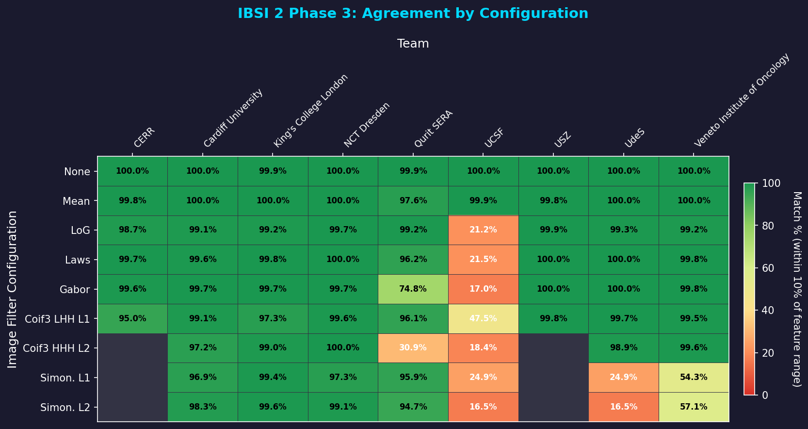
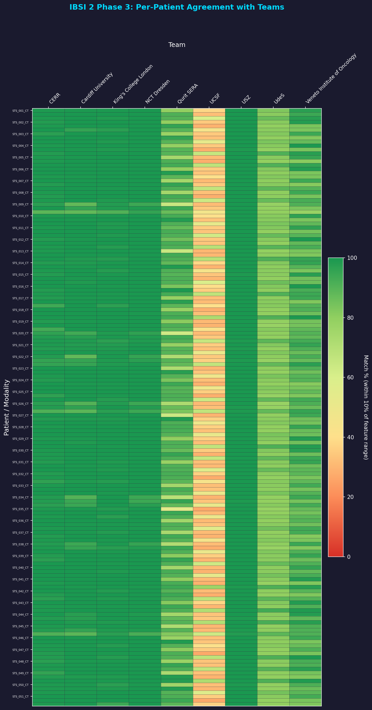

# IBSI 2 Phase 3 Compliance: Reproducibility

## Overview

IBSI 2 Phase 3 focuses on **reproducibility across different software implementations**. Unlike Phases 1 and 2, there are no consensus reference values. Instead, participant results are compared against each other to measure overlap.

This page documents Pictologics' agreement with 9 other teams on a **multimodal (CT, MRI, PET) soft-tissue sarcoma dataset of 51 patients**.

## How to Run the Benchmarks

### 1. Download the Data

-   **IBSI 2 Phase 3 Data**: Please refer to the [IBSI GitHub repository](https://github.com/theibsi/data_sets) for all data download instructions.

Organize the data as follows:
- `data/ibsi2/data/validation/ct/*.nii.gz`
- `data/ibsi2/data/validation/pet/*.nii.gz`
- `data/ibsi2/data/validation/mri/*.nii.gz`
- `data/ibsi2/data/validation/masks/*.nii.gz`

### 2. Run Validation Programmatically

```python
from pictologics import RadiomicsPipeline

# Example: Run Mean filter (ID 2) on a specific patient/modality
image_path = "data/ibsi2/data/validation/ct/STS_001_image.nii.gz"
mask_path = "data/ibsi2/data/validation/masks/STS_001_CT_mask.nii.gz"

pipeline = RadiomicsPipeline()

# Define IBSI 2 Phase 3 CT Preprocessing
preprocess_steps = [
    {"step": "resample", "params": {
        "new_spacing": (1.0, 1.0, 1.0),
        "interpolation": "cubic",
        "mask_interpolation": "linear",
        "mask_threshold": 0.5
    }},
    {"step": "round_intensities", "params": {}},
    {"step": "resegment", "params": {"range_min": -200, "range_max": 200}}
]

# Add Mean Filter (ID 2) and Feature Extraction
config = preprocess_steps + [
    {"step": "filter", "params": {"type": "mean", "support": 3}},
    {"step": "extract_features", "params": {"families": ["intensity"]}}
]

pipeline.add_config("phase3_demo", config)
results = pipeline.run(image_path, mask_path, config_names=["phase3_demo"])
print(results["phase3_demo"])
```

!!! warning "Execution Time"
    **Processing 153 scans (51 patients × 3 modalities) with multiple filters takes significant time** (minutes to hours depending on CPU). The full validation suite is designed to run in parallel on multiple cores.

## Phase 3 Results

**Summary**: Processed 153 scans (51 patients × 3 modalities), compared against 9 teams.

## Tolerance Breakdown (% of Feature Range)

A value matches when its difference from the team's value is within 1, 5 or 10 % of the team's *range for that modality, filter and feature* (the maximum minus the minimum of the team's values over the 51 patients). Our value is first rounded to the team's number of decimals, as in the IBSI tolerance tests. A zero range needs an exact match.

!!! note "A stricter rule than in version 0.5.1"
    Up to version 0.5.1, this page used one range for each team and feature, over all patients, modalities and filters. That range spans the CT, PET and MR values of all filters, so it is wider, and more values matched. This page uses the range of one modality and one filter, so its shares are lower.

    The values did not change. With the old rule, the 0.6.0 values give the same match counts as version 0.5.1 for all 9 teams: 91.97 % of the 205,597 values within 1 % (checked on 2026-10-04).

| Team | Total Features | Within 1% | Within 5% | Within 10% | Status |
|:-----|:--------------:|----------:|----------:|-----------:|:------:|
| CERR | 16524 | 14776 (89.4%) | 16108 (97.5%) | 16329 (98.8%) | ✅ 95%+ |
| Cardiff University | 24786 | 23089 (93.2%) | 24305 (98.1%) | 24505 (98.9%) | ✅ 95%+ |
| King's College London | 23868 | 22321 (93.5%) | 23516 (98.5%) | 23702 (99.3%) | ✅ 95%+ |
| NCT Dresden | 24786 | 24329 (98.2%) | 24575 (99.1%) | 24658 (99.5%) | ✅ 95%+ |
| Qurit SERA | 24751 | 19179 (77.5%) | 20834 (84.2%) | 21591 (87.2%) | 🟢 80-95% |
| UCSF | 24786 | 10096 (40.7%) | 10099 (40.7%) | 10103 (40.8%) | 🟠 40-60% |
| USZ | 16524 | 16396 (99.2%) | 16490 (99.8%) | 16510 (99.9%) | ✅ 95%+ |
| UdeS | 24786 | 20185 (81.4%) | 20325 (82.0%) | 20361 (82.1%) | 🟢 80-95% |
| Veneto Institute of Oncology | 24786 | 19621 (79.2%) | 21277 (85.8%) | 22285 (89.9%) | 🟢 80-95% |

## Agreement by Configuration

The heatmap below shows the percentage of values within 10 % of the team's range (for the modality, filter and feature) for each configuration/team combination.



## Per-Patient Agreement

The heatmap below shows per-patient agreement with each team across all filter configurations.




## Mismatch Details

Mismatches shown below are cases where the error exceeds **10%** of the team's range for the modality, filter and feature.

### Configuration Legend

| Short Name | Full Description |
|------------|------------------|
| None | No filter (baseline) |
| Mean | Mean filter (3×3×3 kernel) |
| LoG | Laplacian of Gaussian (σ=3mm) |
| Laws | Laws S5E5L5 texture filter |
| Gabor | Gabor filter (2D, θ=-5π/8) |
| Coif3 LHH L1 | Coiflet 3 wavelet, LHH decomposition, level 1 |
| Coif3 HHH L2 | Coiflet 3 wavelet, HHH decomposition, level 2 |
| Simon. L1 | Simoncelli steerable pyramid, level 1 (periodic boundary, see below) |
| Simon. L2 | Simoncelli steerable pyramid, level 2 (periodic boundary, see below) |

### Simoncelli Boundary

The IBSI 2 manual's phase 3 table lists the mirror boundary for all filters. For the Simoncelli filters (IDs 8 and 9), Pictologics uses the periodic boundary of its FFT filters, as in IBSI 2 phases 1 and 2, because it gives the better match: over all teams, 58.1 % of the Simoncelli values are within 1 % of the team's range with the periodic boundary and 56.3 % with the mirror boundary; the periodic boundary matches 4 of the 7 teams at least as well. Share of values within 1 % of the range:

| Team | Periodic (used) | Mirror |
|:-----|----------------:|-------:|
| Cardiff University | 79.9% | 82.6% |
| King's College London | 93.0% | 84.0% |
| NCT Dresden | 94.2% | 90.5% |
| Qurit SERA | 86.1% | 82.6% |
| UCSF | 20.7% | 21.2% |
| UdeS | 20.7% | 21.2% |
| Veneto Institute of Oncology | 12.2% | 11.9% |

### CERR

195 of 16524 values differ by more than 10 % of the range. The 10 largest, relative to the range:

| Patient | Feature | Configuration | Pictologics Value | Team Value | Error | Range |
|:--------|:--------|:-------------|----------:|-----------:|------:|------:|
| STS_048_CT | stat_cov | LoG | -7493 | 196.1 | 7690 | 332.3 |
| STS_049_MRI | stat_qcod | LoG | 1749 | 13.98 | 1735 | 105.6 |
| STS_021_MRI | stat_cov | LoG | -1097 | 79.72 | 1176 | 122.7 |
| STS_045_MRI | stat_cov | LoG | -642.1 | -43.01 | 599.1 | 122.7 |
| STS_045_PET | stat_qcod | LoG | -259.9 | -35.09 | 224.8 | 51.05 |
| STS_050_CT | stat_qcod | Coif3 LHH L1 | -1.276e+05 | 1799 | 1.294e+05 | 2.958e+04 |
| STS_020_PET | stat_cov | LoG | -1492 | -302.7 | 1190 | 308.1 |
| STS_050_MRI | stat_cov | LoG | -181.1 | 30.95 | 212.1 | 122.7 |
| STS_003_CT | stat_median | Coif3 LHH L1 | -0.02632 | 0.001908 | 0.02823 | 0.01912 |
| STS_012_CT | stat_cov | Coif3 LHH L1 | -3.283e+05 | 6075 | 3.343e+05 | 2.325e+05 |

### Cardiff University

281 of 24786 values differ by more than 10 % of the range. The 10 largest, relative to the range:

| Patient | Feature | Configuration | Pictologics Value | Team Value | Error | Range |
|:--------|:--------|:-------------|----------:|-----------:|------:|------:|
| STS_049_MRI | stat_qcod | LoG | 1749 | 13.98 | 1735 | 98.73 |
| STS_048_CT | stat_cov | LoG | -7493 | 196.1 | 7690 | 544.8 |
| STS_021_MRI | stat_cov | LoG | -1097 | 27.56 | 1124 | 109.7 |
| STS_045_MRI | stat_cov | LoG | -642.1 | 82.86 | 724.9 | 109.7 |
| STS_014_CT | stat_qcod | LoG | -1188 | 46.59 | 1234 | 293.1 |
| STS_050_CT | stat_qcod | Coif3 LHH L1 | -1.276e+05 | -1.726e+04 | 1.104e+05 | 2.741e+04 |
| STS_021_CT | stat_qcod | Simon. L1 | 1.344e+05 | -5.431e+04 | 1.887e+05 | 5.585e+04 |
| STS_021_CT | stat_cov | Simon. L2 | 7190 | -2915 | 1.01e+04 | 3363 |
| STS_021_PET | stat_qcod | Simon. L2 | -584.6 | 114.2 | 698.8 | 264 |
| STS_038_CT | stat_qcod | Simon. L1 | 1.217e+05 | -227.3 | 1.219e+05 | 5.585e+04 |

### King's College London

166 of 23868 values differ by more than 10 % of the range. The 10 largest, relative to the range:

| Patient | Feature | Configuration | Pictologics Value | Team Value | Error | Range |
|:--------|:--------|:-------------|----------:|-----------:|------:|------:|
| STS_049_MRI | stat_qcod | LoG | 1749 | 13.98 | 1735 | 108.8 |
| STS_048_CT | stat_cov | LoG | -7493 | 196.1 | 7690 | 568.5 |
| STS_021_MRI | stat_cov | LoG | -1097 | 27.56 | 1124 | 102.5 |
| STS_050_CT | stat_qcod | Coif3 LHH L1 | -1.276e+05 | -469.6 | 1.272e+05 | 1.482e+04 |
| STS_021_CT | stat_qcod | Simon. L1 | 1.344e+05 | -1.688e+04 | 1.513e+05 | 1.982e+04 |
| STS_045_MRI | stat_cov | LoG | -642.1 | 75.6 | 717.7 | 102.5 |
| STS_038_CT | stat_qcod | Simon. L1 | 1.217e+05 | 2942 | 1.187e+05 | 1.982e+04 |
| STS_014_CT | stat_qcod | LoG | -1188 | 46.72 | 1235 | 218.2 |
| STS_050_MRI | stat_cov | LoG | -181.1 | 33.91 | 215 | 102.5 |
| STS_021_PET | stat_qcod | Simon. L2 | -584.6 | -220.6 | 364 | 253.3 |

### NCT Dresden

128 of 24786 values differ by more than 10 % of the range. The 10 largest, relative to the range:

| Patient | Feature | Configuration | Pictologics Value | Team Value | Error | Range |
|:--------|:--------|:-------------|----------:|-----------:|------:|------:|
| STS_050_CT | stat_qcod | Coif3 LHH L1 | -1.276e+05 | 3.161e+04 | 1.592e+05 | 4.269e+04 |
| STS_045_PET | stat_qcod | LoG | -259.9 | -71.78 | 188.1 | 88.52 |
| STS_038_CT | stat_qcod | Simon. L1 | 1.217e+05 | -225 | 1.219e+05 | 8.212e+04 |
| STS_034_CT | stat_max | Simon. L1 | 329.1 | 112 | 217.1 | 180.5 |
| STS_026_CT | stat_max | Simon. L1 | 304.1 | 95.66 | 208.4 | 180.5 |
| STS_022_MRI | stat_kurt | Simon. L1 | 55.15 | 20.64 | 34.51 | 32.9 |
| STS_022_CT | stat_max | Simon. L1 | 307.5 | 118.8 | 188.7 | 180.5 |
| STS_022_MRI | stat_skew | Simon. L1 | -1.804 | 2.289 | 4.093 | 3.971 |
| STS_036_MRI | stat_cov | Simon. L1 | -1.632e+04 | 8.126e+05 | 8.289e+05 | 8.145e+05 |
| STS_038_CT | stat_max | Simon. L1 | 300.9 | 120.1 | 180.8 | 180.5 |

### Qurit SERA

3160 of 24751 values differ by more than 10 % of the range. The 10 largest, relative to the range:

| Patient | Feature | Configuration | Pictologics Value | Team Value | Error | Range |
|:--------|:--------|:-------------|----------:|-----------:|------:|------:|
| STS_027_CT | stat_max | Gabor | 2149 | 200 | 1949 | 1 |
| STS_027_CT | stat_range | Gabor | 2149 | 200 | 1949 | 1 |
| STS_035_CT | stat_max | Gabor | 1817 | 200 | 1617 | 1 |
| STS_037_CT | stat_max | Gabor | 1427 | 200 | 1227 | 1 |
| STS_034_CT | stat_max | Gabor | 1375 | 200 | 1175 | 1 |
| STS_034_CT | stat_range | Gabor | 1375 | 200 | 1175 | 1 |
| STS_029_CT | stat_max | Gabor | 1036 | 200 | 836.5 | 1 |
| STS_029_CT | stat_range | Gabor | 1036 | 200 | 836 | 1 |
| STS_001_CT | stat_max | Gabor | 863.4 | 200 | 663.4 | 1 |
| STS_001_CT | stat_range | Gabor | 863.3 | 200 | 663.3 | 1 |

### UCSF

14683 of 24786 values differ by more than 10 % of the range. The 10 largest, relative to the range:

| Patient | Feature | Configuration | Pictologics Value | Team Value | Error | Range |
|:--------|:--------|:-------------|----------:|-----------:|------:|------:|
| STS_001_CT | stat_mean | Laws | 52 | 0 | 52 | 0 |
| STS_001_CT | stat_mean | Gabor | 170 | 0 | 170 | 0 |
| STS_001_CT | stat_mean | Coif3 HHH L2 | 16 | 0 | 16 | 0 |
| STS_001_CT | stat_var | Laws | 99 | 0 | 99 | 0 |
| STS_001_CT | stat_var | Gabor | 1.245e+04 | 0 | 1.245e+04 | 0 |
| STS_001_CT | stat_var | Coif3 LHH L1 | 1 | 0 | 1 | 0 |
| STS_001_CT | stat_var | Coif3 HHH L2 | 96 | 0 | 96 | 0 |
| STS_001_CT | stat_var | Simon. L1 | 250 | 0 | 250 | 0 |
| STS_001_CT | stat_var | Simon. L2 | 76 | 0 | 76 | 0 |
| STS_001_CT | stat_skew | Gabor | 1 | 0 | 1 | 0 |

### USZ

14 of 16524 values differ by more than 10 % of the range. The 10 largest, relative to the range:

| Patient | Feature | Configuration | Pictologics Value | Team Value | Error | Range |
|:--------|:--------|:-------------|----------:|-----------:|------:|------:|
| STS_050_CT | stat_qcod | Coif3 LHH L1 | -1.276e+05 | 3.177e+04 | 1.594e+05 | 4.27e+04 |
| STS_026_PET | stat_qcod | Coif3 LHH L1 | -3163 | -194.8 | 2968 | 2344 |
| STS_045_PET | stat_qcod | Coif3 LHH L1 | 1584 | -688.7 | 2272 | 2344 |
| STS_021_MRI | stat_cov | LoG | -1097 | -592.1 | 504.6 | 721.1 |
| STS_041_PET | stat_qcod | Coif3 LHH L1 | -336.3 | -1338 | 1002 | 2344 |
| STS_015_CT | stat_cov | Coif3 LHH L1 | 1.458e+04 | 1.602e+05 | 1.456e+05 | 4.884e+05 |
| STS_044_MRI | stat_min | Mean | 216 | 150.2 | 65.8 | 258.2 |
| STS_034_MRI | stat_min | Mean | 194.1 | 136 | 58.1 | 258.2 |
| STS_020_PET | stat_cov | LoG | -1492 | -1290 | 202.7 | 1295 |
| STS_026_MRI | stat_min | Mean | 163.9 | 129.1 | 34.75 | 258.2 |

### UdeS

4425 of 24786 values differ by more than 10 % of the range. The 10 largest, relative to the range:

| Patient | Feature | Configuration | Pictologics Value | Team Value | Error | Range |
|:--------|:--------|:-------------|----------:|-----------:|------:|------:|
| STS_001_CT | stat_var | Simon. L1 | 250 | 0 | 250 | 0 |
| STS_001_CT | stat_var | Simon. L2 | 76 | 0 | 76 | 0 |
| STS_001_CT | stat_min | Simon. L1 | -79 | 0 | 79 | 0 |
| STS_001_CT | stat_min | Simon. L2 | -38 | 0 | 38 | 0 |
| STS_001_CT | stat_p10 | Simon. L1 | -20 | 0 | 20 | 0 |
| STS_001_CT | stat_p10 | Simon. L2 | -11 | 0 | 11 | 0 |
| STS_001_CT | stat_p90 | Simon. L1 | 20 | 0 | 20 | 0 |
| STS_001_CT | stat_p90 | Simon. L2 | 11 | 0 | 11 | 0 |
| STS_001_CT | stat_max | Simon. L1 | 78 | 0 | 78 | 0 |
| STS_001_CT | stat_max | Simon. L2 | 43 | 0 | 43 | 0 |

### Veneto Institute of Oncology

2501 of 24786 values differ by more than 10 % of the range. The 10 largest, relative to the range:

| Patient | Feature | Configuration | Pictologics Value | Team Value | Error | Range |
|:--------|:--------|:-------------|----------:|-----------:|------:|------:|
| STS_036_MRI | stat_cov | Simon. L1 | -1.632e+04 | -39.6 | 1.628e+04 | 558.5 |
| STS_001_CT | stat_qcod | Simon. L2 | 2018 | -15.17 | 2033 | 73.8 |
| STS_046_CT | stat_qcod | Simon. L2 | -1328 | 4.325 | 1332 | 73.8 |
| STS_049_MRI | stat_qcod | LoG | 1749 | 13.98 | 1735 | 110 |
| STS_048_CT | stat_cov | LoG | -7493 | 196.1 | 7690 | 573.5 |
| STS_021_MRI | stat_cov | LoG | -1097 | 27.56 | 1124 | 102.5 |
| STS_007_CT | stat_qcod | Simon. L2 | -799.8 | -8.832 | 791 | 73.8 |
| STS_009_CT | stat_qcod | Simon. L2 | 689.8 | 23.41 | 666.4 | 73.8 |
| STS_021_PET | stat_qcod | Simon. L2 | -584.6 | 3.754 | 588.4 | 73.92 |
| STS_021_CT | stat_qcod | Simon. L2 | 519.4 | -20.5 | 539.9 | 73.8 |
