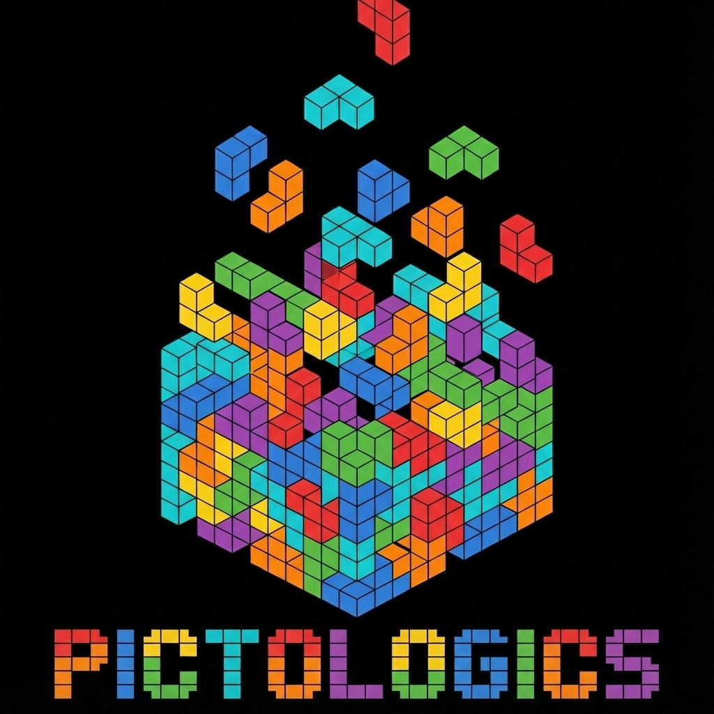

# Welcome to Pictologics

[](https://github.com/martonkolossvary/pictologics/actions/workflows/ci.yml)
[](https://martonkolossvary.github.io/pictologics/)
[](https://pypi.org/project/pictologics/)
[](https://pypi.org/project/pictologics/)
[](https://pypi.org/project/pictologics/)
[](https://github.com/martonkolossvary/pictologics/blob/main/LICENSE)
[](https://codecov.io/gh/martonkolossvary/pictologics)
[](https://github.com/astral-sh/ruff)
[](https://mypy-lang.org/)


{ align=right width=200 }

**Pictologics** is a Python library for radiomic feature extraction from medical images. It follows IBSI 1 (the features) and IBSI 2 (the filters), and it checks its results against the IBSI reference values.

See the [NOTICE](NOTICE.md) file for the attribution and the third-party libraries.

## Why Pictologics?

*   **🚀 Fast**: Numba compiles the computations for your computer, and they run on its fast cores. The [Benchmarks](benchmarks.md) page gives the time of each part.
*   **✅ IBSI compliant**: checked against the IBSI phantoms and data sets:
    *   **IBSI 1** (features): 675 feature values pass; 21 more have a reference value without a tolerance ([report](ibsi1_compliance.md)).
    *   **IBSI 2 Phase 1** (filters): 28 of 28 compared tests pass ([report](ibsi2_compliance.md)).
    *   **IBSI 2 Phase 2** (filtered features): 9 of 9 tests pass ([report](ibsi2_phase2_compliance.md)).
    *   **IBSI 2 Phase 3** (reproducibility): 153 scans, compared with 9 teams ([report](ibsi2_phase3_compliance.md)).
*   **🔧 Versatile**: reads NIfTI, NRRD, MetaImage and DICOM images, DICOM SEG, DICOM RTSTRUCT and 3D Slicer segmentations, and DICOM SR reports.
*   **✨ Easy to use**: pip installs it. One pipeline runs the preprocessing and the features, for one image or for a whole study.
*   **🛡️ Predictable results**: each configuration gives all its feature columns, also when a step fails (the values are then `NaN`). A study table never has missing columns.
*   **🛠️ Maintained**: Pictologics is developed to give robust radiomic features that describe the morphology of diseases on radiological images.

## What Is New in 0.7.0

- **Speed**: on a 512×512×200 CT, timed by turns with 0.6.0 on one computer, the configuration `standard_fbn_32` takes 48 % less time, the six standard configurations 30 % less, and `run_rois` with 20 ROIs 60 % less.
- **Threads**: Pictologics uses the fast cores by default, for example the performance cores of Apple silicon. `set_num_threads()`, `get_num_threads()` and `PICTOLOGICS_NUM_THREADS` set one number for all parallel parts.
- **First run**: the import compiles every numba kernel that a run can use, so no code compiles during a run.
- **Installation**: Intel Macs, and 3D Slicer under Rosetta, can install Pictologics again (with numba 0.62). Matplotlib is now the optional extra `viz`: `pip install "pictologics[viz]"`. pandas 3, Pillow 12, SciPy 1.18 and numba 0.68 work.
- **Fixes**: the DICOM database scan, big-endian and multi-frame DICOM series, the frame positions of DICOM SEG files, NRRD byte skips, and the percentiles of large ROIs (a rare case).
- **Changes**: merged masks keep the type of their inputs (uint8 with `binarize`), and `save_slices` writes one pixel per voxel, with `dpi` as the tag of the file. Some texture and histogram values change in their last digits; the IBSI compliance is the same. See the [Changelog](CHANGELOG.md).

## Key Features

*   **Loaders**: NIfTI, NRRD, MetaImage and DICOM images (also compressed and multiframe DICOM, cardiac phases and PET in SUV), DICOM SEG, DICOM RTSTRUCT and 3D Slicer `.seg.nrrd` masks, and DICOM SR reports.
*   **Preprocessing**: resampling, resegmentation, outlier filtering, the largest component, mask growing and rings in mm, label selection, MR normalisation and discretisation (FBN, FBS and fixed cutoffs).
*   **Features**: the IBSI 1 families: morphology, intensity statistics, intensity histogram, intensity-volume histogram (IVH), local and spatial intensity, and the texture matrices GLCM, GLRLM, GLSZM, GLDZM, NGTDM and NGLDM.
*   **Filters**: the IBSI 2 filters: mean, Gaussian, Laplacian of Gaussian, Laws, Gabor, separable wavelets, Simoncelli and Riesz.
*   **Pipeline**: named configurations of steps, many ROIs (`run_rois`), many cases in parallel (`run_batch`), templates, and shared work between configurations.
*   **Reproducibility**: configurations as YAML or JSON files, a feature catalog (`describe_features`), and a processing log with the configuration hash and the versions.
*   **Utilities**: a DICOM database of patients, studies and series, slice viewers for quality checks, and DICOM SR measurement tables.

## A First Example

```python
from pictologics import RadiomicsPipeline, format_results, save_results

pipeline = RadiomicsPipeline()
results = pipeline.run("ct.nii.gz", "lesion.nii.gz", subject_id="p001", config_names=["standard_fbs_16"])
save_results([format_results(results, meta={"subject_id": "p001"})], "features.csv")
```

## Getting Started

1.  **Install**: see [Installation](user_guide/installation.md).
2.  **Run a first example**: see the [Quick Start](user_guide/quick_start.md).
3.  **Learn the pipeline**: see [The Pipeline](user_guide/pipeline.md) and [Pipeline Steps](user_guide/pipeline_steps.md).
4.  **Find a script for your task**: see the [Cookbook](user_guide/cookbook.md) and the tutorials.
5.  **Look up a function**: see the [API Reference](api/pipeline.md).
